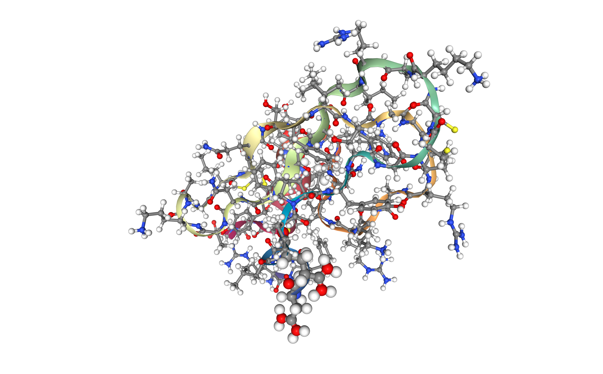
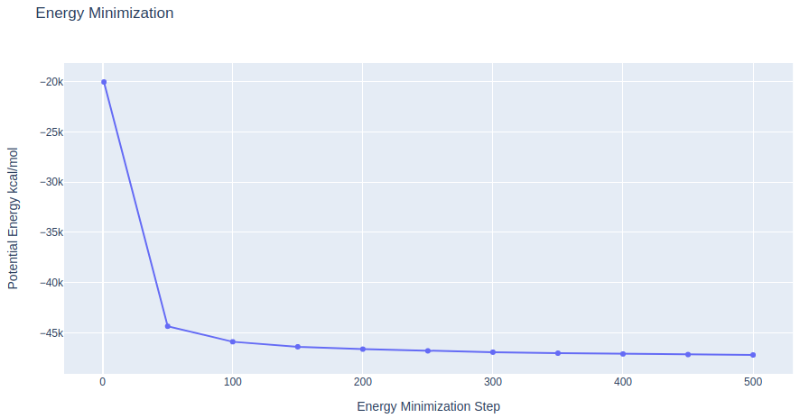

# AMBER Constant pH MD setup tutorial using BioExcel Building Blocks (biobb) 
#### Partly based on:
- AMBER Advanced Tutorial 18: [Constant pH MD Example, Calculating pKas for titratable side chains in HEWL](https://ambermd.org/tutorials/advanced/tutorial18/index.htm) by Jason Swails and T. Dwight McGee Jr.
- AMBER Advanced Tutorial 33: [Constant pH and Redox Potential MD Example: Predicting pH-dependent standard Redox Potential values](https://ambermd.org/tutorials/advanced/tutorial33/) by Vinícius Wilian D. Cruzeiro.
- Modeling of pH sensors for CLN025 beta-hairpin by [Jordi Juárez](https://scholar.google.es/citations?user=hUCtxPwAAAAJ&hl=ca), [Barril Lab](http://www.ub.edu/bl/), University of Barcelona. 
- [Constant pH MD simulation tutorial of BPTI protein in implicit solvent](https://jialuyu.com/constant-ph-md-simulation-of-bpti/) by Wei Zhang, University of the Pacific Stockton.
***
This tutorial aims to illustrate the process of **setting up a simulation system** to run **constant pH** Molecular Dynamics simulations with **AMBER**, step by step, using the **BioExcel Building Blocks library (biobb)** wrapping the **AmberTools** utility from the **AMBER package**. The particular example used is the **Bovine Pancreatic Trypsin Inhibitor (BPTI)** protein (PDB code [6PTI](https://www.rcsb.org/structure/6PTI), [https://doi.org/10.2210/pdb6PTI/pdb](https://doi.org/10.2210/pdb6PTI/pdb)). 
***

## Settings

### Biobb modules used

 - [biobb_io](https://github.com/bioexcel/biobb_io): Tools to fetch biomolecular data from public databases.
 - [biobb_amber](https://github.com/bioexcel/biobb_amber): Tools to setup and run Molecular Dynamics simulations with AmberTools.
 
### Auxiliary libraries used

* [jupyter](https://jupyter.org/): Free software, open standards, and web services for interactive computing across all programming languages.
* [plotly](https://plot.ly/python/offline/): Python interactive graphing library integrated in Jupyter notebooks.
* [nglview](https://nglviewer.org/#nglview): Jupyter/IPython widget to interactively view molecular structures and trajectories in notebooks.
* [simpletraj](https://github.com/arose/simpletraj): Lightweight coordinate-only trajectory reader based on code from GROMACS, MDAnalysis and VMD.
* [gfortran](https://anaconda.org/conda-forge/gfortran): Fortran 95/2003/2008/2018 compiler for GCC, the GNU Compiler Collection.
* [libgfortran5](https://anaconda.org/conda-forge/libgfortran5): Fortran compiler and libraries from the GNU Compiler Collection.

### Conda Installation

```console
git clone https://github.com/bioexcel/biobb_wf_amber.git
cd biobb_wf_amber
conda env create -f conda_env/environment.yml
conda activate biobb_wf_amber
jupyter-notebook biobb_wf_amber/notebooks/md_setup_ph/biobb_wf_amber_md_setup_ph.ipynb
```

***
## Pipeline steps
 1. [Input Parameters](#input)
 2. [Fetching the PDB structure](#fetch)
 3. [Preparing the PDB file for Amber](#pdb4amber)
 4. [Create Protein System Topology](#top)
 5. [Create Solvent Box and Solvating the System](#box)
 6. [Adding Ions](#ions)
 7. [Generating the constant pH input file](#cpinutil1)
 8. [Energetically Minimize the System](#min)
 9. [Heating the System](#heating)
 10. [Equilibrate the System (NVT)](#nvt)
 11. [Equilibrate the System (NPT)](#npt)
 12. [Constant pH Molecular Dynamics Simulation](#free)
 13. [Output Files](#output)
 14. [Questions & Comments](#questions)
 
***

***


## Initializing colab
The two cells below are used only in case this notebook is executed via **Google Colab**. Take into account that, for running conda on **Google Colab**, the **condacolab** library must be installed. As [explained here](https://pypi.org/project/condacolab/), the installation requires a **kernel restart**, so when running this notebook in **Google Colab**, don't run all cells until this **installation** is properly **finished** and the **kernel** has **restarted**.


```python
# Only executed when using google colab
import sys
if 'google.colab' in sys.modules:
  import subprocess
  from pathlib import Path
  try:
    subprocess.run(["conda", "-V"], check=True)
  except FileNotFoundError:
    subprocess.run([sys.executable, "-m", "pip", "install", "condacolab"], check=True)
    import condacolab
    condacolab.install()
    # Clone repository
    repo_URL = "https://github.com/bioexcel/biobb_wf_amber_md_setup.git"
    repo_name = Path(repo_URL).name.split('.')[0]
    if not Path(repo_name).exists():
      subprocess.run(["mamba", "install", "-y", "git"], check=True)
      subprocess.run(["git", "clone", repo_URL], check=True)
      print("⏬ Repository properly cloned.")
    # Install environment
    print("⏳ Creating environment...")
    env_file_path = f"{repo_name}/conda_env/environment.yml"
    subprocess.run(["mamba", "env", "update", "-n", "base", "-f", env_file_path], check=True)
    print("🎨 Install NGLView dependencies...")
    subprocess.run(["mamba", "install", "-y", "-c", "conda-forge", "nglview==3.0.8", "ipywidgets=7.7.2"], check=True)
    print("👍 Conda environment successfully created and updated.")
```


```python
# Enable widgets for colab
if 'google.colab' in sys.modules:
  from google.colab import output
  output.enable_custom_widget_manager()
  # Change working dir
  import os
  os.chdir("biobb_wf_amber/biobb_wf_amber/notebooks/md_setup_ph")
  print(f"📂 New working directory: {os.getcwd()}")
```

<a id="input"></a>
## Input parameters
**Input parameters** needed:
 - **pdbCode**: PDB code of the protein structure (e.g. 6PTI, [https://doi.org/10.2210/pdb6PTI/pdb](https://doi.org/10.2210/pdb6PTI/pdb))


```python
import nglview
import ipywidgets
import plotly
from plotly import subplots
import plotly.graph_objs as go

pdbCode="6PTI"
```

<a id="fetch"></a>
***
## Fetching PDB structure
Downloading **PDB structure** with the **protein molecule** from the RCSB PDB database.<br>
Alternatively, a **PDB file** can be used as starting structure. <br>
***
**Building Blocks** used:
 - [pdb](https://biobb-io.readthedocs.io/en/latest/api.html#module-api.pdb) from **biobb_io.api.pdb**
***


```python
# Import module
from biobb_io.api.pdb import pdb

# Create properties dict and inputs/outputs
downloaded_pdb = pdbCode+'.pdb'

prop = {
    'pdb_code': pdbCode
}

#Create and launch bb
pdb(output_pdb_path=downloaded_pdb,
    properties=prop)
```

<a id="vis3D"></a>
### Visualizing 3D structure
Visualizing the downloaded/given **PDB structure** using **NGL**.  


```python
# Show protein
view = nglview.show_structure_file(downloaded_pdb)
view.add_representation(repr_type='ball+stick', selection='all')
view._remote_call('setSize', target='Widget', args=['','600px'])
view
```

</img>

<a id="pdb4amber"></a>
***
## Preparing PDB file for AMBER
Before starting a **protein MD setup**, it is always strongly recommended to take a look at the initial structure and try to identify important **properties** and also possible **issues**. These properties and issues can be serious, as for example the definition of **disulfide bridges**, the presence of a **non-standard aminoacids** or **ligands**, or **missing residues**. Other **properties** and **issues** might not be so serious, but they still need to be addressed before starting the **MD setup process**. **Missing hydrogen atoms**, presence of **alternate atomic location indicators** or **inserted residue codes** (see [PDB file format specification](https://www.wwpdb.org/documentation/file-format-content/format33/sect9.html#ATOM)) are examples of these not so crucial characteristics. Please visit the [AMBER tutorial: Building Protein Systems in Explicit Solvent](http://ambermd.org/tutorials/basic/tutorial7/index.php) for more examples. **AmberTools** utilities from **AMBER MD package** contain a tool able to analyse **PDB files** and clean them for further usage, especially with the **AmberTools LEaP program**: the **pdb4amber tool**. The next step of the workflow is running this tool to analyse our **input PDB structure**.<br>

For the particular **BPTI** example, the most important features that are going to be used from the **pdb4amber** utility is the identification of **disulfide bridges** in the structure and the renaming of **ionizable residues** for our **constant pH** calculation. **Disulfide bridges** are marked changing the residue names **from CYS to CYX**, which is the code that **AMBER force fields** use to distinguish between cysteines forming or not forming **disulfide bridges**. This will be used in the following step to correctly form a **bond** between these cysteine residues. **Ionizable residues** are also marked changing the residue names, from the deprotonated form to the protonated one (e.g. **from ASN to AS4, from GLN to GL4, and from HIS to HIP**). **Cysteine, Lysine and Tyrosine** residue names are not changed as they are already in their protonated form at **phisiological pH** (pKa > 7.4). 


***
**Building Blocks** used:
 - [pdb4amber_run](https://biobb-amber.readthedocs.io/en/latest/pdb4amber.html#pdb4amber-pdb4amber-run-module) from **biobb_amber.pdb4amber.pdb4amber_run**
***


```python
# Import module
from biobb_amber.pdb4amber.pdb4amber_run import pdb4amber_run

# Create prop dict and inputs/outputs
output_pdb4amber_path = 'structure.pdb4amber.pdb'

prop = {
    'constant_pH' : True
}

# Create and launch bb
pdb4amber_run(input_pdb_path=downloaded_pdb,
             output_pdb_path=output_pdb4amber_path,
             properties=prop)
```

<a id="vis3D"></a>
### Visualizing 3D structure
Visualizing the **PDB structure** with modified residue names for **ionizable residues** using **NGL**. **GL4 and AS4** residues are highlighted.


```python
# Show protein
view = nglview.show_structure_file(output_pdb4amber_path)
view.add_representation(repr_type='ball+stick', selection='all')
view.add_representation(repr_type='ball+stick', radius='0.5', selection='GL4 AS4')
view._remote_call('setSize', target='Widget', args=['','600px'])
view
```

</img>

<a id="top"></a>
***
## Create protein system topology
**Building AMBER topology** corresponding to the **protein structure**.<br>

The **force field** used in this tutorial is [**ff14SB**](https://doi.org/10.1021/acs.jctc.5b00255), an evolution of the **ff99SB** force field with improved accuracy of protein side chains and backbone parameters, and the [**constph**](https://doi.org/10.1002/jcc.20139) force field, including the **constant pH** parameters. **Water** molecules type used in this tutorial is [**tip3p**](https://doi.org/10.1021/jp003020w).<br>

Generating three output files: 
- **AMBER structure** (PDB file)
- **AMBER topology** (AMBER [Parmtop](https://ambermd.org/FileFormats.php#topology) file)
- **AMBER coordinates** (AMBER [Coordinate/Restart](https://ambermd.org/FileFormats.php#restart) file) 
***
**Building Blocks** used:
 - [leap_gen_top](https://biobb-amber.readthedocs.io/en/latest/leap.html#module-leap.leap_gen_top) from **biobb_amber.leap.leap_gen_top**
***


```python
# Import module
from biobb_amber.leap.leap_gen_top import leap_gen_top

# Create prop dict and inputs/outputs
output_pdb_path = 'structure.leap.pdb'
output_top_path = 'structure.leap.top'
output_crd_path = 'structure.leap.crd'

prop = {
    "forcefield" : ["protein.ff14SB","constph"]
}

# Create and launch bb
leap_gen_top(input_pdb_path=output_pdb4amber_path,
           output_pdb_path=output_pdb_path,
           output_top_path=output_top_path,
           output_crd_path=output_crd_path,
           properties=prop)
```

<a id="vis3D"></a>
### Visualizing 3D structure
Visualizing the **PDB structure** after topology generation using **NGL**. Note the newly added **hydrogen atoms**, in particular, the ones for the highlighted protonated **ionizable residues** (GL4, AS4).  


```python
# Show protein
view = nglview.show_structure_file(output_pdb_path)
view.add_representation(repr_type='ball+stick', selection='all')
view.add_representation(repr_type='ball+stick', radius='0.3', selection='GL4 AS4')
view._remote_call('setSize', target='Widget', args=['','600px'])
view
```

</img>

<a id="box"></a>
***
## Create solvent box and solvating the system
Define the unit cell for the **protein structure MD system** to fill it with water molecules.<br>
A **truncated octahedron box** is used to define the unit cell, with a **distance from the structure to the box edge of 9.0 Angstroms**. <br>
The solvent type used is the default **TIP3P** water model, a generic 3-point solvent model.
***
**Building Blocks** used:
 - [leap_solvate](https://biobb-amber.readthedocs.io/en/latest/leap.html#module-leap.leap_solvate) from **biobb_amber.leap.leap_solvate** 
***


```python
# Import module
from biobb_amber.leap.leap_solvate import leap_solvate

# Create prop dict and inputs/outputs
output_solv_pdb_path = 'structure.solv.pdb'
output_solv_top_path = 'structure.solv.parmtop'
output_solv_crd_path = 'structure.solv.crd'

prop = {
    "forcefield" : ["protein.ff14SB","constph"],
    "water_type": "TIP3PBOX",
    "distance_to_molecule": "9.0",  
    "box_type": "truncated_octahedron"
}

# Create and launch bb
leap_solvate(input_pdb_path=output_pdb_path,
           output_pdb_path=output_solv_pdb_path,
           output_top_path=output_solv_top_path,
           output_crd_path=output_solv_crd_path,
           properties=prop)
```

<a id="vis3D"></a>
### Visualizing 3D structure
Visualizing the solvated **PDB structure** using **NGL**.    


```python
# Show protein
view = nglview.show_structure_file(output_solv_pdb_path)
view.clear_representations()
view.add_representation(repr_type='cartoon', selection='protein')
view.add_representation(repr_type='ball+stick', selection='protein')
view.add_representation(repr_type='line', selection='solvent')
view._remote_call('setSize', target='Widget', args=['','600px'])
view
```

</img>

<a id="ions"></a>
## Adding ions

**Neutralizing** the system and adding an additional **ionic concentration** using the **leap tool** from the **AMBER MD package**. <br/>
Using **Sodium (Na+)** and **Chloride (Cl-)** counterions and an **additional ionic concentration** of 150mM.
***
**Building Blocks** used:
 - [leap_add_ions](https://biobb-amber.readthedocs.io/en/latest/leap.html#module-leap.leap_add_ions) from **biobb_amber.leap.leap_add_ions**
***


```python
# Import module
from biobb_amber.leap.leap_add_ions import leap_add_ions

# Create prop dict and inputs/outputs
output_ions_pdb_path = 'structure.ions.pdb'
output_ions_top_path = 'structure.ions.parmtop'
output_ions_crd_path = 'structure.ions.crd'

prop = {
    "forcefield" : ["protein.ff14SB","constph"],
    "neutralise" : True,
    "box_type": "truncated_octahedron"
}

# Create and launch bb
leap_add_ions(input_pdb_path=output_solv_pdb_path,
           output_pdb_path=output_ions_pdb_path,
           output_top_path=output_ions_top_path,
           output_crd_path=output_ions_crd_path,
           properties=prop)
```

<a id="vis3D"></a>
### Visualizing 3D structure
Visualizing the solvated **PDB structure** with the newly added **counterions** (highlighted) using **NGL**. 


```python
# Show protein
view = nglview.show_structure_file(output_ions_pdb_path)
view.clear_representations()
view.add_representation(repr_type='cartoon', selection='protein')
view.add_representation(repr_type='ball+stick', selection='protein')
view.add_representation(repr_type='line', selection='solvent')
view.add_representation(repr_type='spacefill', selection='Cl- Na+', color='green')
view._remote_call('setSize', target='Widget', args=['','600px'])
view
```

</img>

<a id="cpinutil1"></a>
## Generating the constant pH input file

Generating the **constant pH** input file (***cpin file***) using the **cpinutil.py** program from the **AmberTools MD package**. This step is identifying which residues should be **titrated** during the course of the **MD simulation**. <br>
In this particular example, the residues we are interested in **titrating** during the simulation are **Glutamates (GL4)**, **Aspartates (AS4)**, **Cysteines (CYS)**, **Lysines (LYS)** and **Tyrosines (TYR)** (the structure used in this example doesn't contain Histidine residues). 

***
**Building Blocks** used:
 - [parmed_cpinutil](https://biobb-amber.readthedocs.io/en/latest/parmed.html#module-parmed.parmed_cpinutil) from **biobb_amber.parmed.parmed_cpinutil**
***


```python
# Import module
from biobb_amber.parmed.parmed_cpinutil import parmed_cpinutil

# Create prop dict and inputs/outputs
output_cpin_path = 'structure.cpin'
output_top_cpin_path = 'structure.cpH.parmtop'

prop = {
    "igb" : 2,
    "resnames": "AS4 GL4 CYS LYS TYR", # No Histidines in our structure
    "system": "BPTI"
}

# Create and launch bb
parmed_cpinutil(input_top_path=output_ions_top_path,
           output_cpin_path=output_cpin_path,
           output_top_path=output_top_cpin_path,
           properties=prop)
```

<a id="min"></a>
## Energetically minimize the system

**Energetically minimize** the **system** (protein structure + solvent + ions) using the **sander tool** from the **AMBER MD package**. **Restraining backbone atoms** with a force constant of 10 Kcal/mol.$Å^{2}$ to their initial positions.

- [Step 1](#emStep1): Energetically minimize the **system** through 500 minimization cycles.
- [Step 2](#emStep2): Checking **energy minimization** results. Plotting energy by time during the **minimization** process. 
***
**Building Blocks** used:
 - [sander_mdrun](https://biobb-amber.readthedocs.io/en/latest/sander.html#module-sander.sander_mdrun) from **biobb_amber.sander.sander_mdrun**
 - [process_minout](https://biobb-amber.readthedocs.io/en/latest/process.html#module-process.process_minout) from **biobb_amber.process.process_minout**
***

<a id="minv_1"></a>
### Step 1: Energetically minimize the system
**System minimization**, applying **position restraints** (10 Kcal/mol.$Å^{2}$) to the **protein backbone atoms**.


```python
# Import module
from biobb_amber.sander.sander_mdrun import sander_mdrun

# Create prop dict and inputs/outputs
output_min_traj_path = 'sander.cpH.x'
output_min_rst_path = 'sander.cpH.rst'
output_min_log_path = 'sander.cpH.log'

prop = {
    "simulation_type" : "minimization",
    "mdin" : { 
        'maxcyc' : 500,
        'ntr' : 1,           # Turn on positional restraints
        'restraint_wt' : 10,  # 10 kcal/mol/A**2 restraint force constant
        'restraintmask' : '\"@CA,C,O,N\"' # Restraints on the backbone atoms only
    }
}

# Create and launch bb
sander_mdrun(input_top_path=output_top_cpin_path,
            input_crd_path=output_ions_crd_path,
            input_ref_path=output_ions_crd_path,
            output_traj_path=output_min_traj_path,
            output_rst_path=output_min_rst_path,
            output_log_path=output_min_log_path,
            properties=prop)
```

<a id="emStep2"></a>
### Step 2: Checking Energy Minimization results
Checking **energy minimization** results. Plotting **potential energy** along time during the **minimization process**.


```python
# Import module
from biobb_amber.process.process_minout import process_minout

# Create prop dict and inputs/outputs
output_h_min_dat_path = 'sander.min.energy.dat'

prop = {
    "terms" : ['ENERGY']
}

# Create and launch bb
process_minout(input_log_path=output_min_log_path,
            output_dat_path=output_h_min_dat_path,
            properties=prop)
```


```python
import plotly.graph_objs as go

with open(output_h_min_dat_path, 'r') as energy_file:
    x, y = zip(*[
        (float(line.split()[0]), float(line.split()[1]))
        for line in energy_file
        if not line.startswith(("#", "@"))
        if float(line.split()[1]) < 1000
    ])

# Create a scatter plot
fig = go.Figure(data=go.Scatter(x=x, y=y, mode='lines'))

# Update layout
fig.update_layout(title="Energy Minimization",
                  xaxis_title="Energy Minimization Step",
                  yaxis_title="Potential Energy kcal/mol",
                  height=600)

# Show the figure (renderer changes for colab and jupyter)
rend = 'colab' if 'google.colab' in sys.modules else ''
fig.show(renderer=rend)
```

</img>

<a id="heating"></a>
## Heating the system

**Warming up** the **prepared system** using the **sander tool** from the **AMBER MD package**. Going from 0 to the desired **temperature**, in this particular example, 300K. **Protein backbone atoms restrained** (force constant of 2 Kcal/mol). Length 5ps.
***
- [Step 1](#heatStep1): Warming up the **system** through 500 MD steps.
- [Step 2](#heatStep2): Checking results for the **system warming up**. Plotting **temperature** along time during the **heating** process. 
***
**Building Blocks** used:
 - [sander_mdrun](https://biobb-amber.readthedocs.io/en/latest/sander.html#module-sander.sander_mdrun) from **biobb_amber.sander.sander_mdrun**
 - [process_mdout](https://biobb-amber.readthedocs.io/en/latest/process.html#module-process.process_mdout) from **biobb_amber.process.process_mdout**
***

<a id="heatStep1"></a>
### Step 1: Warming up the system
The **heat** type of the **simulation_type property** contains the main default parameters to run a **system warming up**:

-  imin = 0;&nbsp;&nbsp;&nbsp;      Run MD (no minimization)
-  ntx = 5;&nbsp;&nbsp;&nbsp;       Read initial coords and vels from restart file
-  cut = 10.0;&nbsp;&nbsp;&nbsp;    Cutoff for non bonded interactions in Angstroms
-  ntr = 0;&nbsp;&nbsp;&nbsp;       No restrained atoms
-  ntc = 2;&nbsp;&nbsp;&nbsp;       SHAKE for constraining length of bonds involving Hydrogen atoms
-  ntf = 2;&nbsp;&nbsp;&nbsp;       Bond interactions involving H omitted
-  ntt = 3;&nbsp;&nbsp;&nbsp;       Constant temperature using Langevin dynamics
-  ig = -1;&nbsp;&nbsp;&nbsp;       Seed for pseudo-random number generator
-  ioutfm = 1;&nbsp;&nbsp;&nbsp;    Write trajectory in netcdf format
-  iwrap = 1;&nbsp;&nbsp;&nbsp;     Wrap coords into primary box
-  nstlim = 5000;&nbsp;&nbsp;&nbsp; Number of MD steps 
-  dt = 0.002;&nbsp;&nbsp;&nbsp;    Time step (in ps)
-  tempi = 0.0;&nbsp;&nbsp;&nbsp;   Initial temperature (0 K)
-  temp0 = 300.0;&nbsp;&nbsp;&nbsp; Final temperature (300 K)
-  irest = 0;&nbsp;&nbsp;&nbsp;     No restart from previous simulation
-  ntb = 1;&nbsp;&nbsp;&nbsp;       Periodic boundary conditions at constant volume
-  gamma_ln = 1.0;&nbsp;&nbsp;&nbsp;   Collision frequency for Langevin dynamics (in 1/ps)

In this particular example, the **heating** of the system is done in **2500 steps** (5ps) and is going **from 0K to 300K** (note that the number of steps has been reduced in this tutorial, for the sake of time). 


```python
# Import module
from biobb_amber.sander.sander_mdrun import sander_mdrun

# Create prop dict and inputs/outputs
output_heat_traj_path = 'sander.heat.netcdf'
output_heat_rst_path = 'sander.heat.rst'
output_heat_log_path = 'sander.heat.log'

prop = {
    "simulation_type" : "heat",
    "mdin" : { 
        'nstlim' : 2500,     # Reducing the number of steps for the sake of time (5ps)
        'ntr' : 1,           # Turn on positional restraints
        'restraintmask' : '\"@CA,C,O,N\"',         # Restraining protein backbone atoms
        'restraint_wt' : 2.0                       # With a force constant of 2 Kcal/mol*A2
    }
}

# Create and launch bb
sander_mdrun(input_top_path=output_top_cpin_path,
            input_crd_path=output_min_rst_path,
            input_ref_path=output_min_rst_path,
            output_traj_path=output_heat_traj_path,
            output_rst_path=output_heat_rst_path,
            output_log_path=output_heat_log_path,
            properties=prop)
```

<a id="heatStep2"></a>
### Step 2: Checking results from the system warming up
Checking **system warming up** output. Plotting **temperature** along time during the **heating process**.


```python
# Import module
from biobb_amber.process.process_mdout import process_mdout

# Create prop dict and inputs/outputs
output_dat_heat_path = 'sander.md.temp.dat'

prop = {
    "terms" : ['TEMP']
}

# Create and launch bb
process_mdout(input_log_path=output_heat_log_path,
            output_dat_path=output_dat_heat_path,
            properties=prop)
```


```python
import plotly.graph_objs as go

with open(output_dat_heat_path, 'r') as energy_file:
    x, y = zip(*[
        (float(line.split()[0]), float(line.split()[1]))
        for line in energy_file
        if not line.startswith(("#", "@"))
        if float(line.split()[1]) < 1000
    ])

# Create a scatter plot
fig = go.Figure(data=go.Scatter(x=x, y=y, mode='lines'))

# Update layout
fig.update_layout(title="Heating process",
                  xaxis_title="Heating Step (ps)",
                  yaxis_title="Temperature (K)",
                  height=600)

# Show the figure (renderer changes for colab and jupyter)
rend = 'colab' if 'google.colab' in sys.modules else ''
fig.show(renderer=rend)
```

</img>

<a id="nvt"></a>
***
## Equilibrate the system (NVT)
Equilibrate the **protein system** in **NVT ensemble** (constant Number of particles, Volume and Temperature). Protein **backbone atoms** will be restrained using position restraining forces: movement is permitted, but only after overcoming a substantial energy penalty. 

- [Step 1](#eqNVTStep1): Equilibrate the **protein system** with **NVT** ensemble.
- [Step 2](#eqNVTStep2): Checking **NVT Equilibration** results. Plotting **system temperature** by time during the **NVT equilibration** process.  
***
**Building Blocks** used:
 - [sander_mdrun](https://biobb-amber.readthedocs.io/en/latest/sander.html#module-sander.sander_mdrun) from **biobb_amber.sander.sander_mdrun**
 - [process_mdout](https://biobb-amber.readthedocs.io/en/latest/process.html#module-process.process_mdout) from **biobb_amber.process.process_mdout** 
***

<a id="eqNVTStep1"></a>
### Step 1: Equilibrating the system (NVT)
The **nvt** type of the **simulation_type property** contains the main default parameters to run a **system equilibration in NVT ensemble**:

-  imin = 0;&nbsp;&nbsp;&nbsp;      Run MD (no minimization)
-  ntx = 5;&nbsp;&nbsp;&nbsp;       Read initial coords and vels from restart file
-  cut = 10.0;&nbsp;&nbsp;&nbsp;    Cutoff for non bonded interactions in Angstroms
-  ntr = 0;&nbsp;&nbsp;&nbsp;       No restrained atoms
-  ntc = 2;&nbsp;&nbsp;&nbsp;       SHAKE for constraining length of bonds involving Hydrogen atoms
-  ntf = 2;&nbsp;&nbsp;&nbsp;       Bond interactions involving H omitted
-  ntt = 3;&nbsp;&nbsp;&nbsp;       Constant temperature using Langevin dynamics
-  ig = -1;&nbsp;&nbsp;&nbsp;       Seed for pseudo-random number generator
-  ioutfm = 1;&nbsp;&nbsp;&nbsp;    Write trajectory in netcdf format
-  iwrap = 1;&nbsp;&nbsp;&nbsp;     Wrap coords into primary box
-  nstlim = 5000;&nbsp;&nbsp;&nbsp; Number of MD steps 
-  dt = 0.002;&nbsp;&nbsp;&nbsp;    Time step (in ps)
-  irest = 1;&nbsp;&nbsp;&nbsp;     Restart previous simulation
-  ntb = 1;&nbsp;&nbsp;&nbsp;       Periodic boundary conditions at constant volume
-  gamma_ln = 5.0;&nbsp;&nbsp;&nbsp;   Collision frequency for Langevin dynamics (in 1/ps)

In this particular example, the **NVT equilibration** of the system is done in **500 steps** (note that the number of steps has been reduced in this tutorial, for the sake of time). 


```python
# Import module
from biobb_amber.sander.sander_mdrun import sander_mdrun

# Create prop dict and inputs/outputs
output_nvt_traj_path = 'sander.nvt.netcdf'
output_nvt_rst_path = 'sander.nvt.rst'
output_nvt_log_path = 'sander.nvt.log'

prop = {
    "simulation_type" : 'nvt',
    "mdin" : { 
        'nstlim' : 500,      # Reducing the number of steps for the sake of time (1ps)
        'ntr' : 1,           # Turn on positional restraints
        'restraintmask' : '\"@CA,C,O,N\"',         # Restraining protein backbone atoms
        'restraint_wt' : 0.1                       # With a force constant of 0.1 Kcal/mol*A2
    }
}

# Create and launch bb
sander_mdrun(input_top_path=output_top_cpin_path,
            input_crd_path=output_heat_rst_path,
            input_ref_path=output_heat_rst_path,
            output_traj_path=output_nvt_traj_path,
            output_rst_path=output_nvt_rst_path,
            output_log_path=output_nvt_log_path,
            properties=prop)
```

<a id="eqNVTStep2"></a>
### Step 2: Checking NVT Equilibration results
Checking **NVT Equilibration** results. Plotting **system temperature** by time during the NVT equilibration process. 


```python
# Import module
from biobb_amber.process.process_mdout import process_mdout

# Create prop dict and inputs/outputs
output_dat_nvt_path = 'sander.md.nvt.temp.dat'

prop = {
    "terms" : ['TEMP']
}

# Create and launch bb
process_mdout(input_log_path=output_nvt_log_path,
            output_dat_path=output_dat_nvt_path,
            properties=prop)
```


```python
import plotly.graph_objs as go

with open(output_dat_nvt_path, 'r') as energy_file:
    x, y = zip(*[
        (float(line.split()[0]), float(line.split()[1]))
        for line in energy_file
        if not line.startswith(("#", "@"))
        if float(line.split()[1]) < 1000
    ])

# Create a scatter plot
fig = go.Figure(data=go.Scatter(x=x, y=y, mode='lines'))

# Update layout
fig.update_layout(title="NVT equilibration",
                  xaxis_title="Equilibration Step (ps)",
                  yaxis_title="Temperature (K)",
                  height=600)

# Show the figure (renderer changes for colab and jupyter)
rend = 'colab' if 'google.colab' in sys.modules else ''
fig.show(renderer=rend)
```

</img>

<a id="npt"></a>
***
## Equilibrate the system (NPT)
Equilibrate the **protein system** in **NPT ensemble** (constant Number of particles, Pressure and Temperature). Protein **backbone atoms** will be restrained using position restraining forces: movement is permitted, but only after overcoming a substantial energy penalty. 

- [Step 1](#eqNPTStep1): Equilibrate the **protein system** with **NPT** ensemble.
- [Step 2](#eqNPTStep2): Checking **NPT Equilibration** results. Plotting **system pressure and density** by time during the **NVT equilibration** process.  
***
**Building Blocks** used:
 - [sander_mdrun](https://biobb-amber.readthedocs.io/en/latest/sander.html#module-sander.sander_mdrun) from **biobb_amber.sander.sander_mdrun**
 - [process_mdout](https://biobb-amber.readthedocs.io/en/latest/process.html#module-process.process_mdout) from **biobb_amber.process.process_mdout** 
***

<a id="eqNPTStep1"></a>
### Step 1: Equilibrating the system (NPT)
The **npt** type of the **simulation_type property** contains the main default parameters to run a **system equilibration in NPT ensemble**:

-  imin = 0;&nbsp;&nbsp;&nbsp;      Run MD (no minimization)
-  ntx = 5;&nbsp;&nbsp;&nbsp;       Read initial coords and vels from restart file
-  cut = 10.0;&nbsp;&nbsp;&nbsp;    Cutoff for non bonded interactions in Angstroms
-  ntr = 0;&nbsp;&nbsp;&nbsp;       No restrained atoms
-  ntc = 2;&nbsp;&nbsp;&nbsp;       SHAKE for constraining length of bonds involving Hydrogen atoms
-  ntf = 2;&nbsp;&nbsp;&nbsp;       Bond interactions involving H omitted
-  ntt = 3;&nbsp;&nbsp;&nbsp;       Constant temperature using Langevin dynamics
-  ig = -1;&nbsp;&nbsp;&nbsp;       Seed for pseudo-random number generator
-  ioutfm = 1;&nbsp;&nbsp;&nbsp;    Write trajectory in netcdf format
-  iwrap = 1;&nbsp;&nbsp;&nbsp;     Wrap coords into primary box
-  nstlim = 5000;&nbsp;&nbsp;&nbsp; Number of MD steps 
-  dt = 0.002;&nbsp;&nbsp;&nbsp;    Time step (in ps)
-  irest = 1;&nbsp;&nbsp;&nbsp;     Restart previous simulation
-  gamma_ln = 5.0;&nbsp;&nbsp;&nbsp;   Collision frequency for Langevin dynamics (in 1/ps)
-  pres0 = 1.0;&nbsp;&nbsp;&nbsp;   Reference pressure
-  ntp = 1;&nbsp;&nbsp;&nbsp;       Constant pressure dynamics: md with isotropic position scaling
-  taup = 2.0;&nbsp;&nbsp;&nbsp;    Pressure relaxation time (in ps)

In this particular example, the **NPT equilibration** of the system is done in **500 steps** (note that the number of steps has been reduced in this tutorial, for the sake of time). 


```python
# Import module
from biobb_amber.sander.sander_mdrun import sander_mdrun

# Create prop dict and inputs/outputs
output_npt_traj_path = 'sander.npt.netcdf'
output_npt_rst_path = 'sander.npt.rst'
output_npt_log_path = 'sander.npt.log'

prop = {
    "simulation_type" : 'npt',
    "mdin" : { 
        'nstlim' : 500,      # Reducing the number of steps for the sake of time (1ps)
        'ntr' : 1,           # Turn on positional restraints
        'restraintmask' : '\"@CA,C,O,N\"',         # Restraining protein backbone atoms
        'restraint_wt' : 0.1                       # With a force constant of 0.1 Kcal/mol*A2
    }
}

# Create and launch bb
sander_mdrun(input_top_path=output_top_cpin_path,
            input_crd_path=output_nvt_rst_path,
            input_ref_path=output_nvt_rst_path,
            output_traj_path=output_npt_traj_path,
            output_rst_path=output_npt_rst_path,
            output_log_path=output_npt_log_path,
            properties=prop)
```

<a id="eqNPTStep2"></a>
### Step 2: Checking NPT Equilibration results
Checking **NPT Equilibration** results. Plotting **system pressure and density** by time during the **NPT equilibration** process. 


```python
# Import module
from biobb_amber.process.process_mdout import process_mdout

# Create prop dict and inputs/outputs
output_dat_npt_path = 'sander.md.npt.dat'

prop = {
    "terms" : ['PRES','DENSITY']
}

# Create and launch bb
process_mdout(input_log_path=output_npt_log_path,
            output_dat_path=output_dat_npt_path,
            properties=prop)
```


```python
import plotly.graph_objs as go

# Read pressure and density data from file 
with open(output_dat_npt_path, 'r') as pd_file:
    x, y, z = zip(*[
        (float(line.split()[0]), float(line.split()[1]), float(line.split()[2]))
        for line in pd_file
        if not line.startswith(("#", "@"))
        if float(line.split()[1]) < 1000
    ])

# Create a scatter plot
trace1 = go.Scatter(
    x=x,y=y
)
trace2 = go.Scatter(
    x=x,y=z
)

fig = subplots.make_subplots(rows=1, cols=2, print_grid=False)

fig.append_trace(trace1, 1, 1)
fig.append_trace(trace2, 1, 2)

fig['layout']['xaxis1'].update(title='Time (ps)')
fig['layout']['xaxis2'].update(title='Time (ps)')
fig['layout']['yaxis1'].update(title='Pressure (bar)')
fig['layout']['yaxis2'].update(title='Density (Kg*m^-3)')

fig['layout'].update(title='Pressure and Density during NPT Equilibration')
fig['layout'].update(showlegend=False)
fig['layout'].update(height=500)

# Show the figure (renderer changes for colab and jupyter)
rend = 'colab' if 'google.colab' in sys.modules else ''
fig.show(renderer=rend)
```

</img>

<a id="free"></a>
***
## Constant pH Molecular Dynamics Simulation
Upon completion of the **two equilibration phases (NVT and NPT)**, the system is now well-equilibrated at the desired temperature and pressure. The **position restraints** can now be released. The last step of the **protein** MD setup is a short, **free MD simulation**, to ensure the robustness of the system. 
- [Step 1](#mdStep1): Run short MD simulation of the **protein system**.
- [Step 2](#mdStep2): Checking results for the final step of the setup process, the **free MD run**. Plotting **Root Mean Square deviation (RMSd)** and **Radius of Gyration (Rgyr)** by time during the **free MD run** step.
***
**Building Blocks** used:
 - [sander_mdrun](https://biobb-amber.readthedocs.io/en/latest/sander.html#module-sander.sander_mdrun) from **biobb_amber.sander.sander_mdrun**
 - [process_mdout](https://biobb-amber.readthedocs.io/en/latest/process.html#module-process.process_mdout) from **biobb_amber.process.process_mdout** 
 - [cpptraj_rms](https://biobb-analysis.readthedocs.io/en/latest/ambertools.html#module-ambertools.cpptraj_rms) from **biobb_analysis.cpptraj.cpptraj_rms**
 - [cpptraj_rgyr](https://biobb-analysis.readthedocs.io/en/latest/ambertools.html#module-ambertools.cpptraj_rgyr) from **biobb_analysis.cpptraj.cpptraj_rgyr**
***

<a id="mdStep1"></a>
### Step 1: Creating portable binary run file to run a Constant pH MD simulation

The **free** type of the **simulation_type property** contains the main default parameters to run an **unrestrained MD simulation**:

-  imin = 0;&nbsp;&nbsp;&nbsp;      Run MD (no minimization)
-  ntx = 5;&nbsp;&nbsp;&nbsp;       Read initial coords and vels from restart file
-  cut = 10.0;&nbsp;&nbsp;&nbsp;    Cutoff for non bonded interactions in Angstroms
-  ntr = 0;&nbsp;&nbsp;&nbsp;       No restrained atoms
-  ntc = 2;&nbsp;&nbsp;&nbsp;       SHAKE for constraining length of bonds involving Hydrogen atoms
-  ntf = 2;&nbsp;&nbsp;&nbsp;       Bond interactions involving H omitted
-  ntt = 3;&nbsp;&nbsp;&nbsp;       Constant temperature using Langevin dynamics
-  ig = -1;&nbsp;&nbsp;&nbsp;       Seed for pseudo-random number generator
-  ioutfm = 1;&nbsp;&nbsp;&nbsp;    Write trajectory in netcdf format
-  iwrap = 1;&nbsp;&nbsp;&nbsp;     Wrap coords into primary box
-  nstlim = 5000;&nbsp;&nbsp;&nbsp; Number of MD steps 
-  dt = 0.002;&nbsp;&nbsp;&nbsp;    Time step (in ps)

In this particular example, a short, **5ps-length** simulation (2500 steps) is run, for the sake of time. 

On top of these parameters, we will include the **constant pH** specific properties:

- icnstph = 2;&nbsp;&nbsp;&nbsp;       Turn on constant pH for explicit solvent
- saltcon = 0.1;&nbsp;&nbsp;&nbsp;     Use the salt concentration CpHMD was parameterized for
- ntcnstph = 100;&nbsp;&nbsp;&nbsp;    Protonation state change attempt every 100 steps
- ntrelax = 100;&nbsp;&nbsp;&nbsp;     Number of relaxation steps after a successful protonation state change
- solvph = 7.0;&nbsp;&nbsp;&nbsp;      Solvent pH


```python
# Import module
from biobb_amber.sander.sander_mdrun import sander_mdrun

# Create prop dict and inputs/outputs
output_pH_traj_path = 'sander.pH.netcdf'
output_pH_rst_path = 'sander.pH.rst'
output_pH_cpout_path = 'sander.pH.cpout'
output_pH_cprst_path = 'sander.pH.cprst'
output_pH_log_path = 'sander.pH.log'
output_pH_mdinfo_path = 'sander.pH.mdinfo'

prop = {
    "simulation_type" : 'free',
    "mdin" : { 
        'nstlim' : 2500,     # Reducing the number of steps for the sake of time (5ps)
        'ntwx' : 500,        # Print coords to trajectory every 500 steps (1 ps)
        'icnstph' : 2,       # Turn on constant pH for explicit solvent
        'saltcon' : 0.1,     # Use the salt concentration CpHMD was parameterized for
        'ntcnstph' : 100,    # Protonation state change attempt every 100 steps
        'ntrelax' : 100,     # Number of relaxation steps after a successful protonation state change
        'solvph' : 7.0,      # Solvent pH
#        'solvph' : 3.0,       # Acid pH
#        'solvph' : 10.0,      # Basic (alkaline) pH
    }
}

# Create and launch bb
sander_mdrun(input_top_path=output_top_cpin_path,
            input_crd_path=output_npt_rst_path,
            input_cpin_path=output_cpin_path,
            output_traj_path=output_pH_traj_path,
            output_rst_path=output_pH_rst_path,
            output_cpout_path=output_pH_cpout_path,
            output_cprst_path=output_pH_cprst_path,
            output_log_path=output_pH_log_path,
            output_mdinfo_path=output_pH_mdinfo_path,
            properties=prop)
```

<a id="mdStep2"></a>
### Step 2: Checking constant pH MD simulation results

**Protonation states** that are sampled throughout the course of the **constant pH** simulations are written to a **cpout-formatted file**. The program **cphstats** can be used to parse this **cpout file** and extract the **predicted pKa values** along different parameters: 

- The difference between the predicted pKa and the system pH (**Offset**)
- The predicted pKa (**Pred**)
- The fraction of time the residue spends protonated (**Frac Prot**)
- The number of accpeted protonations state transitions (**Transitions**)
- The sum of the fractional protonations (**Average total molecular protonation**)

An additional **population** file is generated, containing the populations of every state for every **titratable residue**, the fraction of snapshots that the system spent in each state for each residue.


```python
# Import module
from biobb_amber.cphstats.cphstats_run import cphstats_run

# Create prop dict and inputs/outputs
output_pH_dat_path = 'cphstats.pH.dat'
output_pH_pop_path = 'cphstats.pH.pop.dat'

prop = {
    'verbose' : True,
    'running_avg_window' : 1
}

# Create and launch bb
cphstats_run(input_cpin_path=output_cpin_path,
            input_cpout_path=output_pH_cpout_path,
            output_dat_path=output_pH_dat_path,
            output_population_path=output_pH_pop_path,
            properties=prop)
```

### Last Remarks

When checking the information from the **predicted pKa values** cphstats.pH.dat and the **state population** cphstats.pH.pop.dat coming from the **constant pH** simulation at physiological pH (~7), you will find that no different states other than the major species appear during the simulation. Try to re-run the **constant pH** simulation again, modifying the pH parameter, using acid (<7) or basic (>7) pH and analyse again the results of the checking (cphstats) step.  

An additional recommended and useful study is to repeat the **constant pH** simulation done in the previous step with different pH values (typically from 0 to 14), and then use the output **deprotonated fractions** for each residue as a function of the pH to plot **titration curves**. See the [AMBER tutorial nº18](https://ambermd.org/tutorials/advanced/tutorial18/section4.htm) or [AMBER tutorial nº33](https://ambermd.org/tutorials/advanced/tutorial33/section4.htm) for more information.

<a id="output"></a>
## Output files

Important **Output files** generated:
 - cphstats.pH.dat: **Predicted pKa values** extracted from the constant pH MD simulation.   
 - cphstats.pH.pop.dat: **Populations** of every state for every **titratable residue**, fraction of snapshots that the system spent in each state for each residue.

***
<a id="questions"></a>

## Questions & Comments

Questions, issues, suggestions and comments are really welcome!

* GitHub issues:
    * [https://github.com/bioexcel/biobb](https://github.com/bioexcel/biobb)

* BioExcel forum:
    * [https://ask.bioexcel.eu/c/BioExcel-Building-Blocks-library](https://ask.bioexcel.eu/c/BioExcel-Building-Blocks-library)

