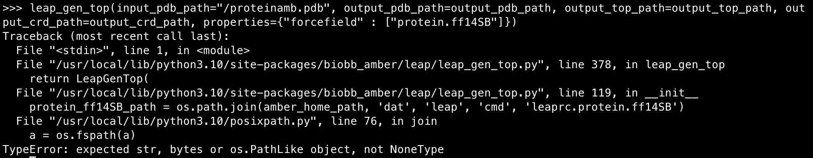

## Setup

Testing commit.

```bash
# Install Docker, minikube, kubectx
sudo snap install kubectx --classic

# Ensure Docker is running (macOS)
open -a Docker

# Need cluster working (on Docker) to run kf
minikube start

# Deploy kfp resources
export PIPELINE_VERSION=2.3.0
kubectl apply -k "github.com/kubeflow/pipelines/manifests/kustomize/cluster-scoped-resources?ref=$PIPELINE_VERSION"
kubectl wait --for condition=established --timeout=60s crd/applications.app.k8s.io
kubectl apply -k "github.com/kubeflow/pipelines/manifests/kustomize/env/dev?ref=$PIPELINE_VERSION"

```

## Usage

The repo is split into two parts: a compiler and a kfp client wrapper.
The "compiler" creates a Docker container to output the pipeline Argo YAML.
The wrapper is merely a script which pushes the pipeline YAML onto a
local (minikube-based) KFlow Pipelines UI.

First, build and run the compiler:
```bash
make build
make compile
```

This should output a `pipeline.yaml` in your local `outputs/` folder.

Then, push the pipeline onto KFlow (make sure you have a running, not pending,
minikube KF Pipelines setup):
```bash
make run
```

## Experience

### MinIO
I chose to use this as a local storage server in between pipeline steps. It
comes with Kubeflow and is relatively straightforward to set up and use for
local demonstration.

You can access the MinIO UI by port forwarding to the service and logging in
with the `minio/minio123` default credentials:

```bash
make port-forward-minio
```

Optionally, install the CLI to access MinIO directly from terminal, instead of
port forwarding  (Brew or Snap for macOS / Linux respectively). Then, configure
to talk to KFlow's instance:

```bash
mc config host add minio http://localhost:9000 minio minio123
```

## Frustrations

1. Had to install `kfp` through `pip` instead of `conda`
as otherwise internal imports failed (`requests_toolbox.appengine`)
2. O God. Never use WSL. Just invest in a Mac
3. "When you're going through Dependency Hell, keep going" -- Winston Churchill
4. `OutputPath`: took me a while to use `Directory` type as thought it 
was filepaths only -> was defining a custom `dsl.Artifact` subclass for `.pdb`
files (which had to be imported into pipe image as a package) and all sorts of 
other crazy things! **Ideally would have specific filepaths as opposed to dirs** 
to reduce coupling and provide cleaner boundaries for Components.
5. Compiler can also technically be run locally as `biobb` deps not necessary,
they don't get imported until `import` is invoked (and compiler doesn't run
functions only trawls them to make the YAML)
6. Kubeflow idiosyncracies - can't specify `InputPath` as kwargs in Component
invocations, etc.
7. Silent fails of dependencies. E.g. `biobb_amber` force field process requires
`AMBERHOME` env var, presumably set by AmberTools? But has nonexistent error
handling, so have to debug inside pods...
8. Provided images not working (e.g. for AMBER topology work) -> had to write,
build, and publish own (nebjovanovic/amber_bio:latest). Related to #7



## Choices

### Infrastructure
Options considered:
1. `minikube`
2. GKE

Using GKE would require setting up the infra (e.g. with Terraform or similar,
or ClickOps) 

### Storage
Options considered:
1. MinIO
2. Volumes
3. Direct input / output passing

## Todo
1. 
