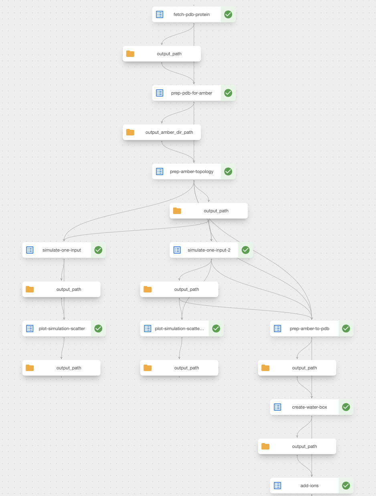

# Kubeflow Pipelines Test

## Setup

### Requirements:

Please make sure you have installed the latest versions of these dependencies:
* Docker and all dependencies ([macOS](https://docs.docker.com/desktop/setup/install/mac-install/), [Linux](https://docs.docker.com/desktop/setup/install/linux/))
* [minikube](https://minikube.sigs.k8s.io/docs/start/?arch=%2Fmacos%2Farm64%2Fstable%2Fbinary+download#:~:text=1,Installation)
* [kubectl](https://kubernetes.io/docs/tasks/tools/)
* make:
    * macOS: `brew install make`
    * ubuntu: `apt-get install build-essential`
    * alpine: `apk add --no-cache make`
* [kubectx](https://github.com/ahmetb/kubectx) (optional, helps manage k8s)
* [uv package manager](https://docs.astral.sh/uv/getting-started/installation/)

Then you will need to setup your Minikube cluster and Kubeflow Pipelines for local 
development and testing:
```bash
make setup-minikube
```

Verify the cluster has been setup properly by listing pods in your `kubeflow` ns (waiting for all of them to be status `Running`):
```bash
kubectl get pods -n kubeflow -w
```

## Usage

The project is split into two parts: a compiler and effectively a kfp client wrapper.
The "compiler" creates a Docker container to output the pipeline Argo YAML.
The wrapper is merely a script which pushes the pipeline YAML onto a
local (minikube-based) KFlow Pipelines server and runs it.

### 1. Compiler

Relatively straight-forward. Run:

```bash
make compile
```

This should output a `pipeline.yaml` in your local `outputs/` folder.
(Hopefully - otherwise, you can rename the `pipeline_example.yaml`
to this and use that.)

### 2. Execution

Before you can push this onto your KFP, you'll need to build a custom 
image that KFP will use for some of the stages (that has AMBER 
dependencies installed). This is built using Minikube's docker daemon 
and pushed onto its registry:

```bash
make build-amber
```

Then, you will need to port forward to the KFP Pipelines Service 
(maps :8080 -> :80) so you can push and run the pipeline:

```bash
make pf-kf
```

Finally push the pipeline onto KFP (make sure you have a running, not pending,
minikube KF Pipelines setup):
```bash
make run
```

You can check whether the pipeline is running by either re-listing the pods 
again and checking if pipe pods are being created and run (with names
including things like `dag-driver`, `impl` etc.) or use the KF Pipelines UI:

http://localhost:8080/#/runs

Hopefully everything works and you get a *beautiful* output in the UI like this!



### Access

Should you wish to access the artefact files, you can forward to your MinIO UI
and use the default `minio` / `minio123` user/pass combo to login:

```bash
make pf-minio
```


## Reasoning

This is a summary of the decision-making process for this project:

### Infrastructure
Options considered:
1. `minikube`
2. GKE

Using GKE would require setting up the infra (e.g. with Terraform or similar,
or ClickOps God forbid) plus adding things like auth/z, so for this project 
was not considered high value for time. 

### Storage
Options considered:
1. MinIO
2. Volumes
3. Direct input / output passing

MinIO comes prepackaged with KFP and was the most straight-forward solution. 
Could have also used permanent volumes or direct input / output passing, 
but these options (1) potentially would've taken too much time (relative 
to the value-add for this project's use-case) and (2) are suboptimal 
for passing large amounts of data (files) between stages.

You can access the MinIO UI by port forwarding to the service and logging in
with the `minio/minio123` default credentials:

```bash
make port-forward-minio
```

Furthermore, I chose to use Minikube's internal Docker registry as opposed 
to pushing images to remote registries or developing them on the host
registry. The former because of privacy / authentication reasons (I don't
think you would want to just pull random images from a personal Dockerhub
repo with no security scans etc...) and the latter because integrating a
locally running container (the Docker registry) with minikube is more complicated
than just running `$ eval $(minikube docker-env)` and building images on 
Minikube's own registry!

### Main ones
1. Use Google's `ml-metadata` to visualise relevant outputs directly in the
Kubeflow Pipelines UI, such as the scatter plots generated. Can also explore
exporting screenshots of the visualisation to allow sense checking of pipe, but this depends on relative value (compared to having a 3D viewer).
2. Choice of pipeline stages: effectively have been grouped into "Fetching",
   "Data preparation" (conversion to/from AMBER/PDB) and "Execution" (i.e. like an
   ML "training" stage but this is not an ML model, so more like "Transformation").
   It seems to me that this pipeline might be preparing the entire protein to
   be an input to a larger pipeline / model (e.g. it is effectively a transformer).
   The reasons for my high-resolution break-up of stages is as follows:
    1. **Allow parallelisation**: For some components, such as the NVT and NPT
       equilibration, having effectively a wrapper around `sander_mdrun` allowed
       in principle two long simulations (5m each on my local) to be run in parallel.
       The same principle allows e.g. analysis / plotting to occur independently of
       future steps. I have seen there exists a `dsl.ParallelFor` function in KFP v1, which could be leveraged for reusing the same image with different
       params (e.g. NVT and NPT equilibration) but ran out of time before
       discovering how it's used, whether it's preferable to use that or just
       specify the tasks separately in the pipeline, and look into best-practice
       approaches for its use.
    2. **Debugging and testing**: from my digging in the `kfp` code, it seems that
       kfp only pushes artefacts etc. at the very end of the component execution;
       thus, any failures and errors cause intermediate artefacts, outputs etc. to
       not be saved. Thus, having stages that were too large / long could have
       slowed down development if a bug crashed the entire stage and all outputs 
       were lost.
    3. **Reusability**: I think I would need more domain-specific knowledge to know
       at which level of resolution we want reusability (e.g. do we ever just
       need to fetch a PDB, or do we always convert PDB -> AMBER files? If the 
       latter, we can combine the fetching + prep stages into one).
    4. **Overhead**: Splitting stages into smaller components adds lots of overhead
       (downloading images, init, package installation -> using more compute, memory,
       and potentially time) but this needs to be balanced against paralleliastion 
       benefits. In more sophisticated pipelines, may also cause proliferation
       of Dockerimages (if using those, as I would recommend, instead of 
       `packages_to_install` in components to avoid cumulative runtime slowdowns). 
       See also #3 (Reusability) above
    5. **Semantics nitpick**: The module names do not correspond to the higher-level
       grouping from above (e.g. there is no actual "Solvation" stage, that's just
       effectively a transformation within the "Transformation" stage) 
       as I would rather organise my namespace according to
       functionality / output. I have found it's much easier to make sense of
       them this way! But can adapt to other approaches
3. Using / not using other components. As stated before, this pipeline looks like
a transformer to prepare an input to a different model / pipeline, so using 
components like KServe was not deemed appropriate (what would we be serving? 
There is no "model" that's been parametrised and would be waiting on prediction-
time inputs to give us an output).

## Frustrations

1. Had to install `kfp` through `pip` instead of `conda`
as otherwise internal imports failed (`requests_toolbox.appengine`)
2. "When you're going through Dependency Hell, keep going" -- Winston Churchill (allegedly)
First started development on WSL as I didn't own a Mac, but decided to borrow
one as it was too convoluted...
3. Conda environment activation within Docker images clunky from my experience,
especially when running custom commands like kfp seem to be (i.e. `sh -c`). 
Took a lot of time attempting to debug this, ended up using a hacky workaround
4. `OutputPath`: took me a while to use `Directory` type as thought it 
was filepaths only -> was defining a custom `dsl.Artifact` subclass for `.pdb`
files (which had to be imported into pipe image as a package) and all sorts of 
other crazy things! **Ideally would have specific filepaths as opposed to dirs** 
to reduce coupling and provide cleaner boundaries for Components.
5. Compiler can also technically be run locally as `biobb` deps not necessary,
they don't get imported until `import` is invoked (and compiler doesn't run
functions only trawls them to make the YAML)
6. Kubeflow idiosyncracies - e.g. typehinted returns in functions create an
`Output` file expectation, and if you don't have this, pod fails (was a red
herring for a while); or `workflow-controller` default listening on 
:9090 and (somehow? maybe CICD tests failed on the kfp repo?) a 
Go script raises a panic trying to bind this port to something else (the
`/metrics` endpoint perhaps?) but it's already bound. My solution was
to patch the deployment's port, although I have seen it just resolve by
itself (before my patch) so not sure what was happening... would debug
with more time, as clashing ports are usually a big issue; 
kubeflow pipelines failing to start (didn't debug this, restarting minikube
cluster works)
7. Silent fails and opaque deps. E.g. `biobb_amber` force field process requires
`AMBERHOME` env var, presumably set by AmberTools? But has nonexistent error
handling, so had to debug inside pods. Turns out, it's just the PATH
to the original (non-Python) packages over which `biobb_amber` wraps

8. Provided images not working (e.g. for AMBER topology work) -> had to write,
build, and publish own (amber_bio:latest) but chunkier! Due to #7 mainly

### More technical todos
1. Download and explore Kubeflow Pipeline manifests, edit and modify to
desired spec and deploy from there to trim unused resources
2. Need to explore more how Kubeflow Pipelines initialises containers as
environment doesn't seem to be inherited. Attemps to change this by: adding conda
deps to `base` rather than a custom env, initialising the conda env in `.bashrc`
and `.bash_profile` (and doing both a login and non-login on the Bash shell),
setting `ENV` vars in Dockerfile, creating a custom `sh` initialisation script
(as the commands in `pipeline.yaml` run through `sh` and therefore seem to bypass
any `CMD`s in the Dockerimage) -- none of these worked. Conda was also an assumed 
constrait due to AMBER repo README which said it's required
to install downstream deps, presumably the AMBER binaries etc.
3. Create a custom package to import to all containers with common code
(e.g. having a `_simulate()` method to promote DRY, instead of having both
`simulate_one_input` and `simulate_two_inputs`) or refactor this into another 
better-practice method.
4. Investigate custom file extensions for `InputPath` and `OutputPath`
type hints. Seems possible but may need subclassing `Artifact` and
importing that logic into Docker images / forking or contributing to KFP. Potentially 
can be part of the custom package from #4. Otherwise, current solution is to just
create a common directory and hard-code desired input / output filenames,
doing joining within functions which is suboptimal due to unnecessary high coupling
5. If wanting to avoid config / definition in-code, can create another config
YAML to import parameters for each pipeline stage before compilation. However
I would recommend against this as the `pipeline.py` file can act as a config
and leads to less clutter
6. Actually fininsh outputting all the analysis steps (e.g. from the free MD
simulation run); ran out of time!
7. Refactor string concatenation for paths using `os.path.join` or `pathlib`
8. Change `src.analysis.scatter` into multiple images instead of doing a weird
conditional import (as realised Kubeflow only likes specific type hints) +
helps with coupling!

### More business / (internal) customer-focused
1. Why are we making this (or a similar) pipeline, e.g. will the model 
output be used for "serving" (think internal API to do things with free molecular 
dynamics sims) or is it a component in future pipelines (e.g. protein:ligand
interactions simulations)?
2. What infrastructure do we already have and how can we leverage this?
3. What similar pipelines / workflows do we have? What can we refactor and abstract?
4. How much of this process can we automate?

### Nitpicks
1. Decided to risk using `uv` over `pip`/`conda` for local dev as it's so much better! :)
2. Linting, formatting, import checks etc. in Make / Taskfile (e.g. ruff, black, flake8)
   just to clean up git commits!
