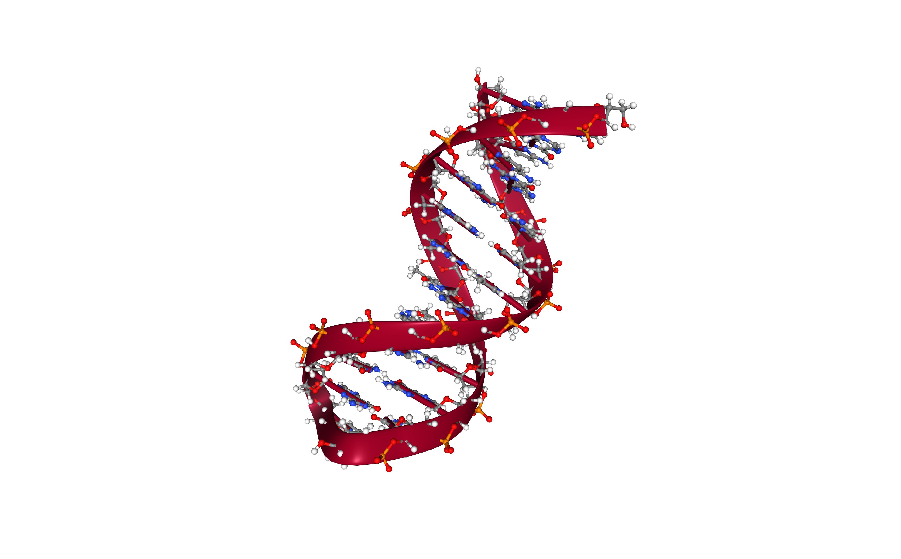

# ABC MD Setup pipeline using BioExcel Building Blocks (biobb)

***

This **BioExcel Building Blocks library (BioBB) workflow** provides a pipeline to setup DNA structures for the **Ascona B-DNA Consortium** (ABC) members. It follows the work started with the [NAFlex](http://mmb.irbbarcelona.org/NAFlex/ABC) tool to offer a single, reproducible pipeline for structure preparation, ensuring **reproducibility** and **coherence** between all the members of the consortium. The **NAFlex pipeline** was used for the preparation of all the simulations done in the study: ***[The static and dynamic structural heterogeneities of B-DNA: extending Calladine–Dickerson rules](https://doi.org/10.1093/nar/gkz905)***. The workflow included in this **Jupyter Notebook** is **extending** and **updating** the **NAFlex pipeline**, following the best practices exposed by the *[Daniel R. Roe and Bernard R. Brooks](https://doi.org/10.1063/5.0013849)* work, and is being used for the **new ABC study**. 

The **setup process** is performed using the **biobb_amber** module from the **BioBB library**, which is wrapping the **AMBER MD package**. The forcefield used is the nucleic acids specific **[parmbsc1 forcefield](https://doi.org/10.1038/nmeth.3658)**, with **[Joung & Cheatham](https://doi.org/10.1021/jp8001614)** monovalent ion parameters for **Ewald** and **TIP4P/EW** water and **[SPC/E Water model](https://doi.org/10.1021/j100308a038)**.

The main **steps of the pipeline** are:

- **Model** the **B-DNA** structure
- Generate structure **topology**
- **Solvate** structure with a truncated octahedron box, with **SCP/E water model**
- **Neutralize** the system with Potassium ions
- Add an **ionic concentration** of 150mM of Cl- / K+ ions
- **Randomize ions** around the structure using cpptraj
- Generate **H-mass repartitioned topology** to run the production simulations with a 4fs timestep
- **Equilibrate** the system in solvent with a 10-steps protocol ([Daniel R. Roe and Bernard R. Brooks](https://doi.org/10.1063/5.0013849))
- **Production Run** (4fs timestep)

***

## Settings

### Biobb module used

 - [biobb_amber](https://github.com/bioexcel/biobb_amber): Tools to setup and run Molecular Dynamics simulations using the AMBER MD package.
 
### Auxiliar libraries used

 - [nb_conda_kernels](https://github.com/Anaconda-Platform/nb_conda_kernels): Enables a Jupyter Notebook or JupyterLab application in one conda environment to access kernels for Python, R, and other languages found in other environments.
 - [nglview](http://nglviewer.org/#nglview): Jupyter/IPython widget to interactively view molecular structures and trajectories in notebooks.
 - [ipywidgets](https://github.com/jupyter-widgets/ipywidgets): Interactive HTML widgets for Jupyter notebooks and the IPython kernel.
 - [plotly](https://plot.ly/python/offline/): Python interactive graphing library integrated in Jupyter notebooks.

### Conda Installation and Launch

```console
 git clone https://github.com/bioexcel/biobb_wf_md_setup_amber.git
 cd biobb_wf_md_setup_amber
 conda env create -f conda_env/environment.yml
 conda activate biobb_MDsetup_tutorials_amber
 jupyter-nbextension enable --py --user widgetsnbextension
 jupyter-nbextension enable --py --user nglview
 jupyter-notebook biobb_wf_md_setup_amber/notebooks/mdsetup_ABC/biobb_amber_ABC_setup.ipynb
  ``` 

***
## Pipeline steps
 1. [Initial Parameters](#input)
 2. [Model DNA 3D Structure](#model)
 3. [Generate Topology](#top)
 4. [Add Water Box](#water)
 5. [Adding additional ionic concentration](#ions)
 6. [Randomize Ions](#random)
 7. [Generate Topology with Hydrogen Mass Partitioning (4fs)](#top4fs)
 8. [System Equilibration](#eq)
 9. [Free MD Simulation](#free)
 10. [Output files](#output)
 
***
<table><tr style="background: white;">
<td>  </td>
<td style="width: 100px;"></td>
<td>  </td>
</tr></table>

***

## Auxiliar libraries


```python
import nglview
import ipywidgets
import plotly
import plotly.graph_objs as go
```


<a id="input"></a>
## Initial parameters

**Input parameters** needed:

- **DNA sequence**: Nucleotide sequence to be modelled and prepared for a MD simulation (e.g. GCGCGGCTGATAAACGAAAGC)
- **Forcefield**: Forcefield to be used in the setup (e.g. protein.ff14SB). 
- **Water model**: Water model to be used in the setup (e.g. SPC/E). 
- **Ion model**: Ion model to be used in the setup (e.g. Dang). 
- **Thermostat**: Thermostat to be used in the setup (e.g. Langevin). 
- **Timestep**: Simulation timestep (e.g 2fs).


```python
seq = "CGCGAATTCGCG" # Drew-Dickerson dodecamer

forcefield = ["DNA.bsc1"] # ParmBSC1 (ff99 + bsc0 + bsc1) for DNA. Ivani et al. Nature Methods 13: 55, 2016
water_model = "OPCBOX" # SPC/E + Joung-Chetham monovalent ions + Li/Merz highly charged ions (+2 to +4, 12-6 normal usage set)
ions_model = "ionsjc_tip4pew" # Monovalent ion parameters for Ewald and TIP4P/EW water from Joung & Cheatham JPCB (2008)
```

<a id="model"></a>
## Model DNA 3D structure

Model **DNA 3D structure** from a **nucleotide sequence** using the **nab tool** from the **AMBER MD package**.
***
**Building Blocks** used:
 - [nab_build_dna_structure](https://biobb-amber.readthedocs.io/en/latest/nab.html#module-nab.nab_build_dna_structure) from **biobb_amber.nab.nab_build_dna_structure**
***


```python
# Import module
from biobb_amber.nab.nab_build_dna_structure import nab_build_dna_structure

# Create properties dict and inputs/outputs
dna_pdb = seq+'.pdb'
prop = {
    'sequence': seq,
    'helix_type': 'abdna', # Right Handed B-DNA, Arnott 
    'remove_tmp': True,
    'linker': 'x86_64-conda_cos6-linux-gnu-gfortran'
}

#Create and launch bb
nab_build_dna_structure(output_pdb_path=dna_pdb,
    properties=prop)
```

### Visualizing 3D structure


```python
# Show protein
view = nglview.show_structure_file(dna_pdb)
view.add_representation(repr_type='ball+stick', selection='all')
view._remote_call('setSize', target='Widget', args=['','600px'])
view
```

</img>

<a id="top"></a>
## Generate Topology

Build the **DNA topology** from the **modelled structure** using the **leap tool** from the **AMBER MD package**.<br/>
Using the **forcefield** fixed in the first cell.
***
**Building Blocks** used:
 - [leap_gen_top](https://biobb-amber.readthedocs.io/en/latest/leap.html#module-leap.leap_gen_top) from **biobb_amber.leap.leap_gen_top**
***


```python
# Import module
from biobb_amber.leap.leap_gen_top import leap_gen_top

# Create prop dict and inputs/outputs
prop = {
    "forcefield" : forcefield
}
dna_leap_pdb_path = 'structure.leap.pdb'
dna_leap_top_path = 'structure.leap.top'
dna_leap_crd_path = 'structure.leap.crd'

# Create and launch bb
leap_gen_top(input_pdb_path=dna_pdb,
           output_pdb_path=dna_leap_pdb_path,
           output_top_path=dna_leap_top_path,
           output_crd_path=dna_leap_crd_path,
           properties=prop)
```


```python
# Show protein
view = nglview.show_structure_file(dna_leap_pdb_path)
view.add_representation(repr_type='ball+stick', selection='all')
view._remote_call('setSize', target='Widget', args=['','600px'])
view
```

</img>

<a id="water"></a>
## Adding Water Box

Creating a **water box** surrounding the **DNA structure** using the **leap tool** from the **AMBER MD package**. <br/>
Using the **water model** fixed in the first cell.
***
**Building Blocks** used:
 - [amber_to_pdb](https://biobb-amber.readthedocs.io/en/latest/ambpdb.html#module-ambpdb.amber_to_pdb) from **biobb_amber.ambpdb.amber_to_pdb**
 - [leap_solvate](https://biobb-amber.readthedocs.io/en/latest/leap.html#module-leap.leap_solvate) from **biobb_amber.leap.leap_solvate**
***

### Add water box
Define the **unit cell** for the **DNA structure MD system** and fill it with **water molecules**.<br/>
A **truncated octahedron** is used to define the unit cell, with a distance from the protein to the box edge of 15Å.
The **water model** used is the one defined in the first cell.


```python
# Import module
from biobb_amber.leap.leap_solvate import leap_solvate

# Create prop dict and inputs/outputs
prop = {
    'forcefield': forcefield,
    'water_type': water_model,
    'ions_type' : ions_model,
    'box_type': 'truncated_octahedron',
    'distance_to_molecule' : 15.0,
    'neutralise' : True,
    'iso' : True,
    'closeness' : 0.97,
    'positive_ions_type' : "K+"
}

output_solv_pdb_path = 'structure.solv.pdb'
output_solv_top_path = 'structure.solv.parmtop'
output_solv_crd_path = 'structure.solv.crd'

# Create and launch bb
leap_solvate( input_pdb_path=dna_leap_pdb_path,
            output_pdb_path=output_solv_pdb_path,
            output_top_path=output_solv_top_path,
            output_crd_path=output_solv_crd_path,
            properties=prop)
```


```python
# Show protein
view = nglview.show_structure_file(output_solv_pdb_path)
view.clear_representations()
view.add_representation(repr_type='ball+stick', selection='nucleic')
view.add_representation(repr_type='line', selection='water')
view._remote_call('setSize', target='Widget', args=['','600px'])
view
```

</img>

<a id="ions"></a>
## Adding additional ionic concentration

**Neutralizing** the system and adding an additional **ionic concentration** using the **leap tool** from the **AMBER MD package**. <br/>
Using **Potassium (K+)** and **Chloride (Cl-)** counterions and an **additional ionic concentration** of 150mM.
***
**Building Blocks** used:
 - [leap_add_ions](https://biobb-amber.readthedocs.io/en/latest/leap.html#module-leap.leap_add_ions) from **biobb_amber.leap.leap_add_ions**
***


```python
# Import module
from biobb_amber.leap.leap_add_ions import leap_add_ions

# Create prop dict and inputs/outputs
prop = {
    'forcefield': forcefield,
    'water_type': water_model,
    'ions_type' : ions_model,
    'box_type': 'truncated_octahedron',
    'ionic_concentration' : 100,  # 100 Mol/L
    'positive_ions_type' : "K+"
}

output_ions_pdb_path = 'structure.ions.pdb'
output_ions_top_path = 'structure.ions.parmtop'
output_ions_crd_path = 'structure.ions.crd'

# Create and launch bb
leap_add_ions(input_pdb_path=output_solv_pdb_path,
           output_pdb_path=output_ions_pdb_path,
           output_top_path=output_ions_top_path,
           output_crd_path=output_ions_crd_path,
           properties=prop)
```


```python
# Show protein
view = nglview.show_structure_file(output_ions_pdb_path)
view.clear_representations()
view.add_representation(repr_type='ball+stick', selection='nucleic')
view.add_representation(repr_type='spacefill', selection='Na+')
view.add_representation(repr_type='spacefill', selection='K+')
view.add_representation(repr_type='spacefill', selection='Cl-')
view._remote_call('setSize', target='Widget', args=['','600px'])
view
```

</img>

<a id="random"></a>
## Randomize ions

**Randomly swap** the positions of **solvent** and **ions** using the **cpptraj tool** from the **AMBER MD package**. <br/>
***
**Building Blocks** used:
 - [cpptraj_randomize_ions](https://biobb-amber.readthedocs.io/en/latest/cpptraj.html#module-cpptraj.cpptraj_randomize_ions) from **biobb_amber.cpptraj.cpptraj_randomize_ions**
***


```python
# Import module
from biobb_amber.cpptraj.cpptraj_randomize_ions import cpptraj_randomize_ions

# Create prop dict and inputs/outputs
prop = { 
    "distance" : 6.0,
    "overlap" : 4.0
}
output_cpptraj_crd_path = 'structure.randIons.crd'
output_cpptraj_pdb_path = 'structure.randIons.pdb'

# Create and launch bb
cpptraj_randomize_ions(
            input_top_path=output_ions_top_path,
            input_crd_path=output_ions_crd_path,
            output_pdb_path=output_cpptraj_pdb_path,
            output_crd_path=output_cpptraj_crd_path,
            properties=prop)
```


```python
# Show protein
view = nglview.show_structure_file(output_cpptraj_pdb_path)
view.clear_representations()
view.add_representation(repr_type='ball+stick', selection='nucleic')
view.add_representation(repr_type='spacefill', selection='K+')
view.add_representation(repr_type='spacefill', selection='Cl-')
view._remote_call('setSize', target='Widget', args=['','600px'])
view
```

</img>

<a id="top4fs"></a>
## Generate Topology with Hydrogen Mass Partitioning (4fs)

Modifying the **DNA topology** from the **modelled structure**, tripling the mass of all hydrogens on the system and scaling down the mass of all other atoms using the **parmed tool** from the **AMBER MD package**.<br/>

***
**Building Blocks** used:
 - [parmed_hmassrepartition](https://biobb-amber.readthedocs.io/en/latest/parmed.html#module-parmed.parmed_hmassrepartition) from **biobb_amber.parmed.parmed_hmassrepartition**
***


```python
# Import module
from biobb_amber.parmed.parmed_hmassrepartition import parmed_hmassrepartition

# Create prop dict and inputs/outputs
dna_leap_top_4fs_path = 'structure.leap.4fs.top'

# Create and launch bb
parmed_hmassrepartition(
    input_top_path=output_ions_top_path,
    output_top_path=dna_leap_top_4fs_path
)
```

<a id="eq"></a>
## Standard Equilibration for explicit solvent

With the **DNA + solvent + counterions** system ready, the next step in the **MD setup** is the **system equilibration**. In this step, atoms of the macromolecules and of the surrounding solvent undergo a relaxation that usually lasts for tens or hundreds of picoseconds before the system reaches a stationary state ([see Amber tutorials](https://ambermd.org/tutorials/advanced/tutorial8/loop7.php)). 

Many different **equilibration protocols** exist. The protocol included in this workflow was prepared, tested and compared with different conditions and DNA sequences by the **ABC consortium**, and finally chosen as the **standard protocol** for the **2021 ABCix run**. It is based on the *[Daniel R. Roe and Bernard R. Brooks](https://doi.org/10.1063/5.0013849)* work (*A protocol for preparing explicitly solvated systems for stable molecular dynamics simulations*) and comprises **10 different stages**: 

 1. [Equilibration Step 1](#eq1) -- System Energetic Minimization, 5 Kcal/mol heavy atoms restraints (1000 cycles)
 2. [Equilibration Step 2](#eq2) -- NVT Equilibration, 5 Kcal/mol heavy atoms restraints, timestep 1fs (15ps)
 3. [Equilibration Step 3](#eq3) -- System Energetic Minimization, 2 Kcal/mol heavy atoms restraints (1000 cycles)
 4. [Equilibration Step 4](#eq4) -- System Energetic Minimization, 0.1 Kcal/mol heavy atoms restraints (1000 cycles)
 5. [Equilibration Step 5](#eq5) -- System Energetic Minimization (1000 cycles)
 6. [Equilibration Step 6](#eq6) -- NPT Equilibration, 1 Kcal/mol heavy atoms restraints, timestep 1fs (5ps)
 7. [Equilibration Step 7](#eq7) -- NPT Equilibration, 0.5 Kcal/mol heavy atoms restraints, timestep 1fs (5ps)
 8. [Equilibration Step 8](#eq8) -- NPT Equilibration, 0.5 Kcal/mol backbone atoms restraints, timestep 1fs (10ps)
 9. [Equilibration Step 9](#eq9) -- NPT Equilibration, timestep 2fs (10ps)
 10. [Equilibration Step 10](#eq10) -- NPT Equilibration, timestep 2fs, long simulation (1ns)
 

<a id="eq1"></a>
### Equilibration Step 1: System energetic minimization

**Energetically minimize** the **DNA structure** (in solvent) using the **sander tool** from the **AMBER MD package**. Relaxing **solvent** molecules around the **DNA structure**. 

**AMBER MD configuration file** used ([step1.in](ABCix_config_files/step1.in)) includes the following **simulation parameters**:
-  imin = 1;&nbsp;&nbsp;&nbsp;&nbsp;           Run minimization
-  ntmin = 2;&nbsp;&nbsp;&nbsp;&nbsp;          Steepest Descent minimization method  
-  maxcyc = 1000;&nbsp;&nbsp;&nbsp;&nbsp;      Number of minimization steps 
-  ncyc = 10;&nbsp;&nbsp;&nbsp;&nbsp;          Switch from steepest descent to conjugate gradient after 10 cycles (if ntmin = 1) 
-  ntwx = 500;&nbsp;&nbsp;&nbsp;&nbsp;         Coordinates will be written to the output trajectory file every 500 steps
-  ioutfm = 1;&nbsp;&nbsp;&nbsp;&nbsp;         Write trajectory in netcdf format
-  ntxo = 2;&nbsp;&nbsp;&nbsp;&nbsp;           Write restart in netcdf format
-  ntpr = 50;&nbsp;&nbsp;&nbsp;&nbsp;          Write energy information to files 'mdout' and 'mdinfo' every 50 steps
-  ntwr = 500;&nbsp;&nbsp;&nbsp;&nbsp;         Write information to restart file every 500 steps
-  ntc = 1;&nbsp;&nbsp;&nbsp;&nbsp;           Turn off SHAKE for constraining length of bonds involving Hydrogen atoms
-  ntf = 1;&nbsp;&nbsp;&nbsp;&nbsp;           Force evaluation: complete interactions are calculated
-  ntb = 1;&nbsp;&nbsp;&nbsp;&nbsp;           Constant Volume Periodic Boundary Conditions (PBC)
-  cut = 8.0;&nbsp;&nbsp;&nbsp;&nbsp;          Cutoff for non bonded interactions in Angstroms
-  ntr = 1;&nbsp;&nbsp;&nbsp;&nbsp;            Turn on positional restraints
-  restraintmask = :1-40&!@H=;&nbsp;&nbsp;&nbsp;&nbsp;     Restraints on DNA atoms only
-  restraint_wt = 5.0;&nbsp;&nbsp;&nbsp;&nbsp;    Restraint force constant

**Minimization step** applying **restraints** on the **DNA heavy atoms** with a **force constant** of **5 Kcal/mol.$Å^{2}$**

***
**Building Blocks** used:
 - [sander_mdrun](https://biobb-amber.readthedocs.io/en/latest/sander.html#module-sander.sander_mdrun) from **biobb_amber.sander.sander_mdrun**
 - [process_minout](https://biobb-amber.readthedocs.io/en/latest/process.html#module-process.process_minout) from **biobb_amber.process.process_minout**
***


```python
# Import module
from biobb_amber.sander.sander_mdrun import sander_mdrun

# Create prop dict and inputs/outputs
prop = {
    "mdin" : { 
        'maxcyc' : 500,  # Overwrite number of minimization steps if needed 
        'restraintmask' : '\":DA,DC,DG,DT,D=3,D=5&!@H=\"' # Overwrite DNA heavy atoms mask to make it more generic
    },
#    "sander_path" : "sander.MPI",  # Change sander binary to parallel (MPI) execution (not included in AmberTools)
#    "mpi_bin" : "mpirun",          # MPI runner 
#    "mpi_np" : 16                  # Number of cores to use in the MPI parallel calculation
}
output_eq1_traj_path = 'sander.eq1.nc'
output_eq1_rst_path = 'sander.eq1.ncrst'
output_eq1_log_path = 'sander.eq1.log'
output_eq1_mdinfo_path = 'sander.eq1.mdinfo'

# Create and launch bb
sander_mdrun(
            input_top_path=dna_leap_top_4fs_path,
            input_mdin_path="ABCix_config_files/step1.in",
            input_crd_path=output_cpptraj_crd_path,
            input_ref_path=output_cpptraj_crd_path,
            output_traj_path=output_eq1_traj_path,
            output_rst_path=output_eq1_rst_path,
            output_mdinfo_path=output_eq1_mdinfo_path,
            output_log_path=output_eq1_log_path,
            properties=prop)
```

### Checking Equilibration Step 1 results
Checking **Equilibration Step 1 - System Energetic Minimization** results. Plotting **potential energy** along time during the **minimization process**.


```python
# Import module
from biobb_amber.process.process_minout import process_minout

# Create prop dict and inputs/outputs
prop = {
    "terms" : ['ENERGY'],
    "remove_tmp": True
}
output_dat_eq1_path = 'sander.eq1.energy.dat'

# Create and launch bb
process_minout(input_log_path=output_eq1_log_path,
            output_dat_path=output_dat_eq1_path,
            properties=prop)
```


```python
#Read data from file and filter energy values higher than 1000 Kj/mol^-1
with open(output_dat_eq1_path,'r') as energy_file:
    x,y = map(
        list,
        zip(*[
            (float(line.split()[0]),float(line.split()[1]))
            for line in energy_file 
            if not line.startswith(("#","@")) 
            if float(line.split()[1]) < 1000 
        ])
    )

plotly.offline.init_notebook_mode(connected=True)

fig = {
    "data": [go.Scatter(x=x, y=y)],
    "layout": go.Layout(title="Equilibration Step 1",
                        xaxis=dict(title = "Energy Minimization Step"),
                        yaxis=dict(title = "Potential Energy kcal/mol")
                       )
}

plotly.offline.iplot(fig)
```

</img>

<a id="eq2"></a>
### Equilibration Step 2: NVT equilibration

**Equilibrate** the **system** in **NVT** ensemble (constant number of particles -N-, Volume -V-, and Temperature -T-), using the **sander tool** from the **AMBER MD package**. Taking the system to the desired **temperature**. 

**AMBER MD configuration file** used ([step2.in](ABCix_config_files/step2.in)) includes the following **simulation parameters**:
-  imin = 0;&nbsp;&nbsp;&nbsp;&nbsp;           Run MD (no minimization)
-  nstlim = 15000;&nbsp;&nbsp;&nbsp;&nbsp;     Number of MD steps
-  dt = 0.001;&nbsp;&nbsp;&nbsp;&nbsp;         Time step (in ps)
-  ntx = 1;&nbsp;&nbsp;&nbsp;&nbsp;            Only read initial coordinates from input files
-  irest = 0;&nbsp;&nbsp;&nbsp;&nbsp;          Do not restart a simulation, start a new one
-  ig = -1;&nbsp;&nbsp;&nbsp;&nbsp;            Seed for the pseudo-random number generator
-  ntwx = 500;&nbsp;&nbsp;&nbsp;&nbsp;         Coordinates will be written to the output trajectory file every 500 steps
-  ntwv = -1;&nbsp;&nbsp;&nbsp;&nbsp;          Velocities will be written to output trajectory file, making it a combined coordinate/velocity trajectory file, at the interval defined by ntwx
-  ioutfm = 1;&nbsp;&nbsp;&nbsp;&nbsp;         Write trajectory in netcdf format
-  ntxo = 2;&nbsp;&nbsp;&nbsp;&nbsp;           Write restart in netcdf format
-  ntpr = 50;&nbsp;&nbsp;&nbsp;&nbsp;          Write energy information to files 'mdout' and 'mdinfo' every 50 steps
-  ntwr = 500;&nbsp;&nbsp;&nbsp;&nbsp;         Write information to restart file every 500 steps
-  iwrap = 0;&nbsp;&nbsp;&nbsp;&nbsp;          Not wrapping coordinates into primary box
-  nscm = 0;&nbsp;&nbsp;&nbsp;&nbsp;           Not removing translational and rotational center-of-mass motions
-  ntc = 2;&nbsp;&nbsp;&nbsp;&nbsp;            Turn on SHAKE for constraining length of bonds involving Hydrogen atoms
-  ntf = 2;&nbsp;&nbsp;&nbsp;&nbsp;            Force evaluation: Bond interactions involving H omitted (SHAKE)
-  ntb = 1;&nbsp;&nbsp;&nbsp;&nbsp;            Constant Volume Periodic Boundary Conditions (PBC)
-  cut = 8.0;&nbsp;&nbsp;&nbsp;&nbsp;          Cutoff for non bonded interactions in Angstroms
-  ntt = 3;&nbsp;&nbsp;&nbsp;&nbsp;            Constant temperature using Langevin dynamics
-  gamma_ln = 5;&nbsp;&nbsp;&nbsp;&nbsp;       Collision frequency for Langevin dynamics (in 1/ps)
-  temp0 = 310.0;&nbsp;&nbsp;&nbsp;            Final temperature (310 K)
-  tempi = 310.0;&nbsp;&nbsp;&nbsp;            Initial temperature (310 K)
-  ntr = 1;&nbsp;&nbsp;&nbsp;&nbsp;            Turn on positional restraints
-  restraintmask = :1-40&!@H=;&nbsp;&nbsp;&nbsp;&nbsp;     Restraints on DNA atoms only
-  restraint_wt = 5.0;&nbsp;&nbsp;&nbsp;&nbsp;    Restraint force constant

**NVT equilibration step** applying **restraints** on the **DNA heavy atoms** with a **force constant** of **5 Kcal/mol.$Å^{2}$**

***
**Building Blocks** used:
 - [sander_mdrun](https://biobb-amber.readthedocs.io/en/latest/sander.html#module-sander.sander_mdrun) from **biobb_amber.sander.sander_mdrun**
 - [process_mdout](https://biobb-amber.readthedocs.io/en/latest/process.html#module-process.process_mdout) from **biobb_amber.process.process_mdout** 
***


```python
# Import module
from biobb_amber.sander.sander_mdrun import sander_mdrun

# Create prop dict and inputs/outputs
prop = {
    "mdin" : { 
        'nstlim' : 500,  # Overwrite number of MD steps if needed 
        'restraintmask' : '\":DA,DC,DG,DT,D=3,D=5&!@H=\"' # Overwrite DNA heavy atoms mask to make it more generic
    },
#    "sander_path" : "sander.MPI",  # Change sander binary to parallel (MPI) execution (not included in AmberTools)
#    "mpi_bin" : "mpirun",          # MPI runner 
#    "mpi_np" : 16                  # Number of cores to use in the MPI parallel calculation
}
output_eq2_traj_path = 'sander.eq2.nc'
output_eq2_rst_path = 'sander.eq2.ncrst'
output_eq2_log_path = 'sander.eq2.log'
output_eq2_mdinfo_path = 'sander.eq2.mdinfo'

# Create and launch bb
sander_mdrun(input_top_path=dna_leap_top_4fs_path,
            input_mdin_path="ABCix_config_files/step2.in",
            input_crd_path=output_eq1_rst_path,
            input_ref_path=output_eq1_rst_path,
            output_traj_path=output_eq2_traj_path,
            output_rst_path=output_eq2_rst_path,
            output_log_path=output_eq2_log_path,
            output_mdinfo_path=output_eq2_mdinfo_path,
            properties=prop)
```

### Checking Equilibration Step 2 results
Checking **Equilibration Step 2 - NVT Equilibration** results. Plotting **temperature** by time during the **equilibration process**.


```python
# Import module
from biobb_amber.process.process_mdout import process_mdout

# Create prop dict and inputs/outputs
prop = {
    "terms" : ['TEMP']
}
output_dat_eq2_path = 'sander.eq2.energy.dat'

# Create and launch bb
process_mdout(input_log_path=output_eq2_log_path,
            output_dat_path=output_dat_eq2_path,
            properties=prop)
```


```python
#Read data from file and filter energy values higher than 1000 Kj/mol^-1
with open(output_dat_eq2_path,'r') as energy_file:
    x,y = map(
        list,
        zip(*[
            (float(line.split()[0]),float(line.split()[1]))
            for line in energy_file 
            if not line.startswith(("#","@")) 
            if float(line.split()[1]) < 1000 
        ])
    )

plotly.offline.init_notebook_mode(connected=True)

fig = {
    "data": [go.Scatter(x=x, y=y)],
    "layout": go.Layout(title="Equilibration Step 2 - NVT equilibration",
                        xaxis=dict(title = "Energy equilibration time (ps)"),
                        yaxis=dict(title = "Temperature (K)")
                       )
}

plotly.offline.iplot(fig)
```

</img>

<a id="eq3"></a>
### Equilibration Step 3: System energetic minimization

**Energetically minimize** the **DNA structure** (in solvent) using the **sander tool** from the **AMBER MD package**. Relaxing **system** with **soft restraints** on the **DNA structure**. 
 
**AMBER MD configuration file** used ([step3.in](ABCix_config_files/step3.in)) includes the following **simulation parameters**:
-  imin = 1;&nbsp;&nbsp;&nbsp;&nbsp;           Run minimization
-  ntmin = 2;&nbsp;&nbsp;&nbsp;&nbsp;          Steepest Descent minimization method  
-  maxcyc = 1000;&nbsp;&nbsp;&nbsp;&nbsp;      Number of minimization steps 
-  ncyc = 10;&nbsp;&nbsp;&nbsp;&nbsp;          Switch from steepest descent to conjugate gradient after 10 cycles (if ntmin = 1) 
-  ntwx = 500;&nbsp;&nbsp;&nbsp;&nbsp;         Coordinates will be written to the output trajectory file every 500 steps
-  ioutfm = 1;&nbsp;&nbsp;&nbsp;&nbsp;         Write trajectory in netcdf format
-  ntxo = 2;&nbsp;&nbsp;&nbsp;&nbsp;           Write restart in netcdf format
-  ntpr = 50;&nbsp;&nbsp;&nbsp;&nbsp;          Write energy information to files 'mdout' and 'mdinfo' every 50 steps
-  ntwr = 500;&nbsp;&nbsp;&nbsp;&nbsp;         Write information to restart file every 500 steps
-  ntc = 1;&nbsp;&nbsp;&nbsp;&nbsp;           Turn off SHAKE for constraining length of bonds involving Hydrogen atoms
-  ntf = 1;&nbsp;&nbsp;&nbsp;&nbsp;           Force evaluation: complete interactions are calculated
-  ntb = 1;&nbsp;&nbsp;&nbsp;&nbsp;           Constant Volume Periodic Boundary Conditions (PBC)
-  cut = 8.0;&nbsp;&nbsp;&nbsp;&nbsp;          Cutoff for non bonded interactions in Angstroms
-  ntr = 1;&nbsp;&nbsp;&nbsp;&nbsp;            Turn on positional restraints
-  restraintmask = :1-40&!@H=;&nbsp;&nbsp;&nbsp;&nbsp;     Restraints on DNA atoms only
-  restraint_wt = 2.0;&nbsp;&nbsp;&nbsp;&nbsp;    Restraint force constant

Further **minimization step** lowering the **restraints** on the **DNA heavy atoms** to **2 Kcal/mol.$Å^{2}$** force constant.

***
**Building Blocks** used:
 - [sander_mdrun](https://biobb-amber.readthedocs.io/en/latest/sander.html#module-sander.sander_mdrun) from **biobb_amber.sander.sander_mdrun**
 - [process_minout](https://biobb-amber.readthedocs.io/en/latest/process.html#module-process.process_minout) from **biobb_amber.process.process_minout**
***


```python
# Import module
from biobb_amber.sander.sander_mdrun import sander_mdrun

# Create prop dict and inputs/outputs
prop = {
    "mdin" : { 
        'maxcyc' : 500,  # Overwrite number of minimization steps if needed 
        'restraintmask' : '\":DA,DC,DG,DT,D=3,D=5&!@H=\"' # Overwrite DNA heavy atoms mask to make it more generic
    },
#    "sander_path" : "sander.MPI",  # Change sander binary to parallel (MPI) execution (not included in AmberTools)
#    "mpi_bin" : "mpirun",          # MPI runner 
#    "mpi_np" : 16                  # Number of cores to use in the MPI parallel calculation
}
output_eq3_traj_path = 'sander.eq3.nc'
output_eq3_rst_path = 'sander.eq3.ncrst'
output_eq3_log_path = 'sander.eq3.log'
output_eq3_mdinfo_path = 'sander.eq3.mdinfo'

# Create and launch bb
sander_mdrun(input_top_path=dna_leap_top_4fs_path,
            input_mdin_path="ABCix_config_files/step3.in",
            input_crd_path=output_eq2_rst_path,
            input_ref_path=output_eq2_rst_path,
            output_traj_path=output_eq3_traj_path,
            output_rst_path=output_eq3_rst_path,
            output_log_path=output_eq3_log_path,
            output_mdinfo_path=output_eq3_mdinfo_path,
            properties=prop)
```

### Checking Equilibration Step 3 results
Checking **Equilibration Step 3 - System Energetic Minimization** results. Plotting **potential energy** along time during the **minimization process**.


```python
# Import module
from biobb_amber.process.process_minout import process_minout

# Create prop dict and inputs/outputs
prop = {
    "terms" : ['ENERGY']
}
output_dat_eq3_path = 'sander.eq3.energy.dat'

# Create and launch bb
process_minout(input_log_path=output_eq3_log_path,
            output_dat_path=output_dat_eq3_path,
            properties=prop)
```


```python
#Read data from file and filter energy values higher than 1000 Kj/mol^-1
with open(output_dat_eq3_path,'r') as energy_file:
    x,y = map(
        list,
        zip(*[
            (float(line.split()[0]),float(line.split()[1]))
            for line in energy_file 
            if not line.startswith(("#","@")) 
            if float(line.split()[1]) < 1000 
        ])
    )

plotly.offline.init_notebook_mode(connected=True)

fig = {
    "data": [go.Scatter(x=x, y=y)],
    "layout": go.Layout(title="Equilibration Step 3",
                        xaxis=dict(title = "Energy Minimization Step"),
                        yaxis=dict(title = "Potential Energy kcal/mol")
                       )
}

plotly.offline.iplot(fig)
```

</img>

<a id="eq4"></a>
### Equilibration Step 4: System energetic minimization

**Energetically minimize** the **DNA structure** (in solvent) using the **sander tool** from the **AMBER MD package**. Relaxing **system** with **minimum restraints** on the **DNA structure**. 
 
**AMBER MD configuration file** used ([step4.in](ABCix_config_files/step4.in)) includes the following **simulation parameters**:
-  imin = 1;&nbsp;&nbsp;&nbsp;&nbsp;           Run minimization
-  ntmin = 2;&nbsp;&nbsp;&nbsp;&nbsp;          Steepest Descent minimization method  
-  maxcyc = 1000;&nbsp;&nbsp;&nbsp;&nbsp;      Number of minimization steps 
-  ncyc = 10;&nbsp;&nbsp;&nbsp;&nbsp;          Switch from steepest descent to conjugate gradient after 10 cycles (if ntmin = 1) 
-  ntwx = 500;&nbsp;&nbsp;&nbsp;&nbsp;         Coordinates will be written to the output trajectory file every 500 steps
-  ioutfm = 1;&nbsp;&nbsp;&nbsp;&nbsp;         Write trajectory in netcdf format
-  ntxo = 2;&nbsp;&nbsp;&nbsp;&nbsp;           Write restart in netcdf format
-  ntpr = 50;&nbsp;&nbsp;&nbsp;&nbsp;          Write energy information to files 'mdout' and 'mdinfo' every 50 steps
-  ntwr = 500;&nbsp;&nbsp;&nbsp;&nbsp;         Write information to restart file every 500 steps
-  ntc = 1;&nbsp;&nbsp;&nbsp;&nbsp;           Turn off SHAKE for constraining length of bonds involving Hydrogen atoms
-  ntf = 1;&nbsp;&nbsp;&nbsp;&nbsp;           Force evaluation: complete interactions are calculated
-  ntb = 1;&nbsp;&nbsp;&nbsp;&nbsp;           Constant Volume Periodic Boundary Conditions (PBC)
-  cut = 8.0;&nbsp;&nbsp;&nbsp;&nbsp;          Cutoff for non bonded interactions in Angstroms
-  ntr = 1;&nbsp;&nbsp;&nbsp;&nbsp;            Turn on positional restraints
-  restraintmask = :1-40&!@H=;&nbsp;&nbsp;&nbsp;&nbsp;     Restraints on DNA atoms only
-  restraint_wt = 0.1;&nbsp;&nbsp;&nbsp;&nbsp;    Restraint force constant

Further **minimization step** lowering the **restraints** on the **DNA heavy atoms** to **0.1 Kcal/mol.$Å^{2}$** force constant.

***
**Building Blocks** used:
 - [sander_mdrun](https://biobb-amber.readthedocs.io/en/latest/sander.html#module-sander.sander_mdrun) from **biobb_amber.sander.sander_mdrun**
 - [process_minout](https://biobb-amber.readthedocs.io/en/latest/process.html#module-process.process_minout) from **biobb_amber.process.process_minout**
***


```python
# Import module
from biobb_amber.sander.sander_mdrun import sander_mdrun

# Create prop dict and inputs/outputs
prop = {
    "mdin" : { 
        'maxcyc' : 500,  # Overwrite number of minimization steps if needed 
        'restraintmask' : '\":DA,DC,DG,DT,D=3,D=5&!@H=\"' # Overwrite DNA heavy atoms mask to make it more generic
    },
#    "sander_path" : "sander.MPI",  # Change sander binary to parallel (MPI) execution (not included in AmberTools)
#    "mpi_bin" : "mpirun",          # MPI runner 
#    "mpi_np" : 16                  # Number of cores to use in the MPI parallel calculation
}
output_eq4_traj_path = 'sander.eq4.nc'
output_eq4_rst_path = 'sander.eq4.ncrst'
output_eq4_log_path = 'sander.eq4.log'
output_eq4_mdinfo_path = 'sander.eq4.mdinfo'

# Create and launch bb
sander_mdrun(input_top_path=dna_leap_top_4fs_path,
            input_mdin_path="ABCix_config_files/step4.in",
            input_crd_path=output_eq3_rst_path,
            input_ref_path=output_eq3_rst_path,
            output_traj_path=output_eq4_traj_path,
            output_rst_path=output_eq4_rst_path,
            output_log_path=output_eq4_log_path,
            output_mdinfo_path=output_eq4_mdinfo_path,
            properties=prop)
```

### Checking Equilibration Step 4 results
Checking **Equilibration Step 4 - System Energetic Minimization** results. Plotting **potential energy** along time during the **minimization process**.


```python
# Import module
from biobb_amber.process.process_minout import process_minout

# Create prop dict and inputs/outputs
prop = {
    "terms" : ['ENERGY']
}
output_dat_eq4_path = 'sander.eq4.energy.dat'

# Create and launch bb
process_minout(input_log_path=output_eq4_log_path,
            output_dat_path=output_dat_eq4_path,
            properties=prop)
```


```python
#Read data from file and filter energy values higher than 1000 Kj/mol^-1
with open(output_dat_eq4_path,'r') as energy_file:
    x,y = map(
        list,
        zip(*[
            (float(line.split()[0]),float(line.split()[1]))
            for line in energy_file 
            if not line.startswith(("#","@")) 
            if float(line.split()[1]) < 1000 
        ])
    )

plotly.offline.init_notebook_mode(connected=True)

fig = {
    "data": [go.Scatter(x=x, y=y)],
    "layout": go.Layout(title="Equilibration Step 4",
                        xaxis=dict(title = "Energy Minimization Step"),
                        yaxis=dict(title = "Potential Energy kcal/mol")
                       )
}

plotly.offline.iplot(fig)
```

</img>

<a id="eq5"></a>
### Equilibration Step 5: System energetic minimization

**Energetically minimize** the **DNA structure** (in solvent) using the **sander tool** from the **AMBER MD package**. Relaxing **system** **without restraints** on the **DNA structure**. 

**AMBER MD configuration file** used ([step5.in](ABCix_config_files/step5.in)) includes the following **simulation parameters**:
-  imin = 1;&nbsp;&nbsp;&nbsp;&nbsp;           Run minimization
-  ntmin = 2;&nbsp;&nbsp;&nbsp;&nbsp;          Steepest Descent minimization method  
-  maxcyc = 1000;&nbsp;&nbsp;&nbsp;&nbsp;      Number of minimization steps 
-  ncyc = 10;&nbsp;&nbsp;&nbsp;&nbsp;          Switch from steepest descent to conjugate gradient after 10 cycles (if ntmin = 1) 
-  ntwx = 500;&nbsp;&nbsp;&nbsp;&nbsp;         Coordinates will be written to the output trajectory file every 500 steps
-  ioutfm = 1;&nbsp;&nbsp;&nbsp;&nbsp;         Write trajectory in netcdf format
-  ntxo = 2;&nbsp;&nbsp;&nbsp;&nbsp;           Write restart in netcdf format
-  ntpr = 50;&nbsp;&nbsp;&nbsp;&nbsp;          Write energy information to files 'mdout' and 'mdinfo' every 50 steps
-  ntwr = 500;&nbsp;&nbsp;&nbsp;&nbsp;         Write information to restart file every 500 steps
-  ntc = 1;&nbsp;&nbsp;&nbsp;&nbsp;           Turn off SHAKE for constraining length of bonds involving Hydrogen atoms
-  ntf = 1;&nbsp;&nbsp;&nbsp;&nbsp;           Force evaluation: complete interactions are calculated
-  ntb = 1;&nbsp;&nbsp;&nbsp;&nbsp;           Constant Volume Periodic Boundary Conditions (PBC)
-  cut = 8.0;&nbsp;&nbsp;&nbsp;&nbsp;          Cutoff for non bonded interactions in Angstroms
-  ntr = 0;&nbsp;&nbsp;&nbsp;&nbsp;            Turn off positional restraints

Further **minimization step**, with all **position restraints** on the **DNA heavy atoms** released.

***
**Building Blocks** used:
 - [sander_mdrun](https://biobb-amber.readthedocs.io/en/latest/sander.html#module-sander.sander_mdrun) from **biobb_amber.sander.sander_mdrun**
 - [process_minout](https://biobb-amber.readthedocs.io/en/latest/process.html#module-process.process_minout) from **biobb_amber.process.process_minout**
***


```python
# Import module
from biobb_amber.sander.sander_mdrun import sander_mdrun

# Create prop dict and inputs/outputs
prop = {
    "mdin" : { 
        'maxcyc' : 500  # Overwrite number of minimization steps if needed 
    },
#    "sander_path" : "sander.MPI",  # Change sander binary to parallel (MPI) execution (not included in AmberTools)
#    "mpi_bin" : "mpirun",          # MPI runner 
#    "mpi_np" : 16                  # Number of cores to use in the MPI parallel calculation
}
output_eq5_traj_path = 'sander.eq5.nc'
output_eq5_rst_path = 'sander.eq5.ncrst'
output_eq5_log_path = 'sander.eq5.log'
output_eq5_mdinfo_path = 'sander.eq5.mdinfo'

# Create and launch bb
sander_mdrun(input_top_path=dna_leap_top_4fs_path,
            input_mdin_path="ABCix_config_files/step5.in",
            input_crd_path=output_eq4_rst_path,
            input_ref_path=output_eq4_rst_path,
            output_traj_path=output_eq5_traj_path,
            output_rst_path=output_eq5_rst_path,
            output_log_path=output_eq5_log_path,
            output_mdinfo_path=output_eq5_mdinfo_path,
            properties=prop)
```

### Checking Equilibration Step 5 results
Checking **Equilibration Step 5 - System Energetic Minimization** results. Plotting **potential energy** along time during the **minimization process**.


```python
# Import module
from biobb_amber.process.process_minout import process_minout

# Create prop dict and inputs/outputs
prop = {
    "terms" : ['ENERGY']
}
output_dat_eq5_path = 'sander.eq5.energy.dat'

# Create and launch bb
process_minout(input_log_path=output_eq5_log_path,
            output_dat_path=output_dat_eq5_path,
            properties=prop)
```


```python
#Read data from file and filter energy values higher than 1000 Kj/mol^-1
with open(output_dat_eq5_path,'r') as energy_file:
    x,y = map(
        list,
        zip(*[
            (float(line.split()[0]),float(line.split()[1]))
            for line in energy_file 
            if not line.startswith(("#","@")) 
            if float(line.split()[1]) < 1000 
        ])
    )

plotly.offline.init_notebook_mode(connected=True)

fig = {
    "data": [go.Scatter(x=x, y=y)],
    "layout": go.Layout(title="Equilibration Step 5",
                        xaxis=dict(title = "Energy Minimization Step"),
                        yaxis=dict(title = "Potential Energy kcal/mol")
                       )
}

plotly.offline.iplot(fig)
```

</img>

<a id="eq6"></a>
### Equilibration Step 6: NPT equilibration

**Equilibrate** the **system** in **NPT** ensemble (constant number of particles -N-, Pressure -P-, and Temperature -T-), using the **sander tool** from the **AMBER MD package**. 

**AMBER MD configuration file** used ([step6.in](ABCix_config_files/step6.in)) includes the following **simulation parameters**:

-  imin = 0;&nbsp;&nbsp;&nbsp;&nbsp;           Run MD (no minimization)
-  nstlim = 5000;&nbsp;&nbsp;&nbsp;&nbsp;      Number of MD steps
-  dt = 0.001;&nbsp;&nbsp;&nbsp;&nbsp;         Time step (in ps)
-  ntx = 1;&nbsp;&nbsp;&nbsp;&nbsp;            Only read initial coordinates from input files
-  irest = 0;&nbsp;&nbsp;&nbsp;&nbsp;          Do not restart a simulation, start a new one
-  ig = -1;&nbsp;&nbsp;&nbsp;&nbsp;            Seed for the pseudo-random number generator
-  ntwx = 500;&nbsp;&nbsp;&nbsp;&nbsp;         Coordinates will be written to the output trajectory file every 500 steps
-  ntwv = -1;&nbsp;&nbsp;&nbsp;&nbsp;          Velocities will be written to output trajectory file, making it a combined coordinate/velocity trajectory file, at the interval defined by ntwx
-  ioutfm = 1;&nbsp;&nbsp;&nbsp;&nbsp;         Write trajectory in netcdf format
-  ntxo = 2;&nbsp;&nbsp;&nbsp;&nbsp;           Write restart in netcdf format
-  ntpr = 50;&nbsp;&nbsp;&nbsp;&nbsp;          Write energy information to files 'mdout' and 'mdinfo' every 50 steps
-  ntwr = 500;&nbsp;&nbsp;&nbsp;&nbsp;         Write information to restart file every 500 steps
-  iwrap = 0;&nbsp;&nbsp;&nbsp;&nbsp;          Not wrapping coordinates into primary box
-  nscm = 0;&nbsp;&nbsp;&nbsp;&nbsp;           Not removing translational and rotational center-of-mass motions
-  ntc = 2;&nbsp;&nbsp;&nbsp;&nbsp;            Turn on SHAKE for constraining length of bonds involving Hydrogen atoms
-  ntf = 2;&nbsp;&nbsp;&nbsp;&nbsp;            Force evaluation: Bond interactions involving H omitted (SHAKE)
-  ntb = 2;&nbsp;&nbsp;&nbsp;&nbsp;            Constant Pressure Periodic Boundary Conditions (PBC)
-  cut = 8.0;&nbsp;&nbsp;&nbsp;&nbsp;          Cutoff for non bonded interactions in Angstroms
-  ntt = 3;&nbsp;&nbsp;&nbsp;&nbsp;            Constant temperature using Langevin dynamics
-  gamma_ln = 5;&nbsp;&nbsp;&nbsp;&nbsp;       Collision frequency for Langevin dynamics (in 1/ps)
-  temp0 = 310.0;&nbsp;&nbsp;&nbsp;&nbsp;      Final temperature (310 K)
-  tempi = 310.0;&nbsp;&nbsp;&nbsp;&nbsp;      Initial temperature (310 K)
-  ntp = 1;&nbsp;&nbsp;&nbsp;&nbsp;            Constant pressure dynamics: md with isotropic position scaling
-  barostat = 2;&nbsp;&nbsp;&nbsp;&nbsp;       Monte Carlo Barostat
-  pres0 = 1.0;&nbsp;&nbsp;&nbsp;&nbsp;        Reference pressure at which the system is maintained
-  ntr = 1;&nbsp;&nbsp;&nbsp;&nbsp;            Turn on positional restraints
-  restraintmask = :1-40&!@H=;&nbsp;&nbsp;&nbsp;&nbsp;     Restraints on DNA atoms only
-  restraint_wt = 1.0;&nbsp;&nbsp;&nbsp;&nbsp;    Restraint force constant

**NPT equilibration step** applying **restraints** on the **DNA heavy atoms** with a **force constant** of **1 Kcal/mol.$Å^{2}$**

***
**Building Blocks** used:
 - [sander_mdrun](https://biobb-amber.readthedocs.io/en/latest/sander.html#module-sander.sander_mdrun) from **biobb_amber.sander.sander_mdrun**
 - [process_mdout](https://biobb-amber.readthedocs.io/en/latest/process.html#module-process.process_mdout) from **biobb_amber.process.process_mdout** 
***


```python
# Import module
from biobb_amber.sander.sander_mdrun import sander_mdrun

# Create prop dict and inputs/outputs
prop = {
    "mdin" : { 
        'nstlim' : 500,  # Overwrite number of MD steps if needed 
        'restraintmask' : '\":DA,DC,DG,DT,D=3,D=5&!@H=\"' # Overwrite DNA heavy atoms mask to make it more generic
    },
#    "sander_path" : "sander.MPI",  # Change sander binary to parallel (MPI) execution (not included in AmberTools)
#    "mpi_bin" : "mpirun",          # MPI runner 
#    "mpi_np" : 16                  # Number of cores to use in the MPI parallel calculation
}
output_eq6_traj_path = 'sander.eq6.nc'
output_eq6_rst_path = 'sander.eq6.ncrst'
output_eq6_log_path = 'sander.eq6.log'
output_eq6_mdinfo_path = 'sander.eq6.mdinfo'

# Create and launch bb
sander_mdrun(input_top_path=dna_leap_top_4fs_path,
            input_mdin_path="ABCix_config_files/step6.in",
            input_crd_path=output_eq5_rst_path,
            input_ref_path=output_eq5_rst_path,
            output_traj_path=output_eq6_traj_path,
            output_rst_path=output_eq6_rst_path,
            output_log_path=output_eq6_log_path,
            output_mdinfo_path=output_eq6_mdinfo_path,
            properties=prop)
```

### Checking Equilibration Step 6 results
Checking **Equilibration Step 6 - NPT Equilibration** results. Plotting **density** and **pressure** by time during the **equilibration process**.


```python
# Import module
from biobb_amber.process.process_mdout import process_mdout

# Create prop dict and inputs/outputs
prop = {
    "terms" : ['PRES','DENSITY']
}
output_dat_eq6_path = 'sander.eq6.pressure_and_density.dat'

# Create and launch bb
process_mdout(input_log_path=output_eq6_log_path,
            output_dat_path=output_dat_eq6_path,
            properties=prop)
```


```python
# Read pressure and density data from file 
from plotly import subplots
with open(output_dat_eq6_path,'r') as pd_file:
    x,y,z = map(
        list,
        zip(*[
            (float(line.split()[0]),float(line.split()[1]),float(line.split()[2]))
            for line in pd_file 
            if not line.startswith(("#","@")) 
        ])
    )

plotly.offline.init_notebook_mode(connected=True)

trace1 = go.Scatter(
    x=x,y=y
)
trace2 = go.Scatter(
    x=x,y=z
)

fig = subplots.make_subplots(rows=1, cols=2, print_grid=False)

fig.append_trace(trace1, 1, 1)
fig.append_trace(trace2, 1, 2)

fig['layout']['xaxis1'].update(title='Time (ps)')
fig['layout']['xaxis2'].update(title='Time (ps)')
fig['layout']['yaxis1'].update(title='Pressure (bar)')
fig['layout']['yaxis2'].update(title='Density (Kg*m^-3)')

fig['layout'].update(title='Pressure and Density during NPT Equilibration')
fig['layout'].update(showlegend=False)

plotly.offline.iplot(fig)
```

</img>

<a id="eq7"></a>
### Equilibration Step 7: NPT equilibration

**Equilibrate** the **system** in **NPT** ensemble (constant number of particles -N-, Pressure -P-, and Temperature -T-), using the **sander tool** from the **AMBER MD package**. Lowering **restraints force constant**. 

**AMBER MD configuration file** used ([step7.in](ABCix_config_files/step7.in)) includes the following **simulation parameters**:

-  imin = 0;&nbsp;&nbsp;&nbsp;&nbsp;           Run MD (no minimization)
-  nstlim = 5000;&nbsp;&nbsp;&nbsp;&nbsp;      Number of MD steps
-  dt = 0.001;&nbsp;&nbsp;&nbsp;&nbsp;         Time step (in ps)
-  ntx = 5;&nbsp;&nbsp;&nbsp;&nbsp;            Read initial coordinates and velocities from restart file
-  irest = 1;&nbsp;&nbsp;&nbsp;&nbsp;          Restart previous simulation from restart file
-  ig = -1;&nbsp;&nbsp;&nbsp;&nbsp;            Seed for the pseudo-random number generator
-  ntwx = 500;&nbsp;&nbsp;&nbsp;&nbsp;         Coordinates will be written to the output trajectory file every 500 steps
-  ntwv = -1;&nbsp;&nbsp;&nbsp;&nbsp;          Velocities will be written to output trajectory file, making it a combined coordinate/velocity trajectory file, at the interval defined by ntwx
-  ioutfm = 1;&nbsp;&nbsp;&nbsp;&nbsp;         Write trajectory in netcdf format
-  ntxo = 2;&nbsp;&nbsp;&nbsp;&nbsp;           Write restart in netcdf format
-  ntpr = 50;&nbsp;&nbsp;&nbsp;&nbsp;          Write energy information to files 'mdout' and 'mdinfo' every 50 steps
-  ntwr = 500;&nbsp;&nbsp;&nbsp;&nbsp;         Write information to restart file every 500 steps
-  iwrap = 0;&nbsp;&nbsp;&nbsp;&nbsp;          Not wrapping coordinates into primary box
-  nscm = 0;&nbsp;&nbsp;&nbsp;&nbsp;           Not removing translational and rotational center-of-mass motions
-  ntc = 2;&nbsp;&nbsp;&nbsp;&nbsp;            Turn on SHAKE for constraining length of bonds involving Hydrogen atoms
-  ntf = 2;&nbsp;&nbsp;&nbsp;&nbsp;            Force evaluation: Bond interactions involving H omitted (SHAKE)
-  ntb = 2;&nbsp;&nbsp;&nbsp;&nbsp;            Constant Pressure Periodic Boundary Conditions (PBC)
-  cut = 8.0;&nbsp;&nbsp;&nbsp;&nbsp;          Cutoff for non bonded interactions in Angstroms
-  ntt = 3;&nbsp;&nbsp;&nbsp;&nbsp;            Constant temperature using Langevin dynamics
-  gamma_ln = 5;&nbsp;&nbsp;&nbsp;&nbsp;       Collision frequency for Langevin dynamics (in 1/ps)
-  temp0 = 310.0;&nbsp;&nbsp;&nbsp;&nbsp;      Final temperature (310 K)
-  tempi = 310.0;&nbsp;&nbsp;&nbsp;&nbsp;      Initial temperature (310 K)
-  ntp = 1;&nbsp;&nbsp;&nbsp;&nbsp;            Constant pressure dynamics: md with isotropic position scaling
-  barostat = 2;&nbsp;&nbsp;&nbsp;&nbsp;       Monte Carlo Barostat
-  pres0 = 1.0;&nbsp;&nbsp;&nbsp;&nbsp;        Reference pressure at which the system is maintained
-  ntr = 1;&nbsp;&nbsp;&nbsp;&nbsp;            Turn on positional restraints
-  restraintmask = :1-40&!@H=;&nbsp;&nbsp;&nbsp;&nbsp;     Restraints on DNA atoms only
-  restraint_wt = 0.5;&nbsp;&nbsp;&nbsp;&nbsp;    Restraint force constant

**NPT equilibration step** applying **restraints** on the **DNA heavy atoms** with a **force constant** of **0.5 Kcal/mol.$Å^{2}$**. <br>
**Restarting** from previous equilibration step. 

***
**Building Blocks** used:
 - [sander_mdrun](https://biobb-amber.readthedocs.io/en/latest/sander.html#module-sander.sander_mdrun) from **biobb_amber.sander.sander_mdrun**
 - [process_mdout](https://biobb-amber.readthedocs.io/en/latest/process.html#module-process.process_mdout) from **biobb_amber.process.process_mdout** 
***


```python
# Import module
from biobb_amber.sander.sander_mdrun import sander_mdrun

# Create prop dict and inputs/outputs
prop = {
    "mdin" : { 
        'nstlim' : 500,  # Overwrite number of MD steps if needed 
        'restraintmask' : '\":DA,DC,DG,DT,D=3,D=5&!@H=\"' # Overwrite DNA heavy atoms mask to make it more generic
    },
#    "sander_path" : "sander.MPI",  # Change sander binary to parallel (MPI) execution (not included in AmberTools)
#    "mpi_bin" : "mpirun",          # MPI runner 
#    "mpi_np" : 16                  # Number of cores to use in the MPI parallel calculation
}
output_eq7_traj_path = 'sander.eq7.nc'
output_eq7_rst_path = 'sander.eq7.ncrst'
output_eq7_log_path = 'sander.eq7.log'
output_eq7_mdinfo_path = 'sander.eq7.mdinfo'

# Create and launch bb
sander_mdrun(input_top_path=dna_leap_top_4fs_path,
            input_mdin_path="ABCix_config_files/step7.in",
            input_crd_path=output_eq6_rst_path,
            input_ref_path=output_eq6_rst_path,
            output_traj_path=output_eq7_traj_path,
            output_rst_path=output_eq7_rst_path,
            output_log_path=output_eq7_log_path,
            output_mdinfo_path=output_eq7_mdinfo_path,
            properties=prop)
```

### Checking Equilibration Step 7 results
Checking **Equilibration Step 7 - NPT Equilibration** results. Plotting **density** and **pressure** by time during the **equilibration process**.


```python
# Import module
from biobb_amber.process.process_mdout import process_mdout

# Create prop dict and inputs/outputs
prop = {
    "terms" : ['PRES','DENSITY']
}
output_dat_eq7_path = 'sander.eq7.pressure_and_density.dat'

# Create and launch bb
process_mdout(input_log_path=output_eq7_log_path,
            output_dat_path=output_dat_eq7_path,
            properties=prop)
```


```python
# Read pressure and density data from file 
from plotly import subplots
with open(output_dat_eq7_path,'r') as pd_file:
    x,y,z = map(
        list,
        zip(*[
            (float(line.split()[0]),float(line.split()[1]),float(line.split()[2]))
            for line in pd_file 
            if not line.startswith(("#","@")) 
        ])
    )

plotly.offline.init_notebook_mode(connected=True)

trace1 = go.Scatter(
    x=x,y=y
)
trace2 = go.Scatter(
    x=x,y=z
)

fig = subplots.make_subplots(rows=1, cols=2, print_grid=False)

fig.append_trace(trace1, 1, 1)
fig.append_trace(trace2, 1, 2)

fig['layout']['xaxis1'].update(title='Time (ps)')
fig['layout']['xaxis2'].update(title='Time (ps)')
fig['layout']['yaxis1'].update(title='Pressure (bar)')
fig['layout']['yaxis2'].update(title='Density (Kg*m^-3)')

fig['layout'].update(title='Pressure and Density during NPT Equilibration')
fig['layout'].update(showlegend=False)

plotly.offline.iplot(fig)
```

</img>

<a id="eq8"></a>
### Equilibration Step 8: NPT equilibration

**Equilibrate** the **system** in **NPT** ensemble (constant number of particles -N-, Pressure -P-, and Temperature -T-), using the **sander tool** from the **AMBER MD package**. Releasing **position restraints** from the atoms of the **DNA bases** (keeping only backbone atoms restrained).  

**AMBER MD configuration file** used ([step8.in](ABCix_config_files/step8.in)) includes the following **simulation parameters**:

-  imin = 0;&nbsp;&nbsp;&nbsp;&nbsp;           Run MD (no minimization)
-  nstlim = 10000;&nbsp;&nbsp;&nbsp;&nbsp;      Number of MD steps
-  dt = 0.001;&nbsp;&nbsp;&nbsp;&nbsp;         Time step (in ps)
-  ntx = 5;&nbsp;&nbsp;&nbsp;&nbsp;            Read initial coordinates and velocities from restart file
-  irest = 1;&nbsp;&nbsp;&nbsp;&nbsp;          Restart previous simulation from restart file
-  ig = -1;&nbsp;&nbsp;&nbsp;&nbsp;            Seed for the pseudo-random number generator
-  ntwx = 500;&nbsp;&nbsp;&nbsp;&nbsp;         Coordinates will be written to the output trajectory file every 500 steps
-  ntwv = -1;&nbsp;&nbsp;&nbsp;&nbsp;          Velocities will be written to output trajectory file, making it a combined coordinate/velocity trajectory file, at the interval defined by ntwx
-  ioutfm = 1;&nbsp;&nbsp;&nbsp;&nbsp;         Write trajectory in netcdf format
-  ntxo = 2;&nbsp;&nbsp;&nbsp;&nbsp;           Write restart in netcdf format
-  ntpr = 50;&nbsp;&nbsp;&nbsp;&nbsp;          Write energy information to files 'mdout' and 'mdinfo' every 50 steps
-  ntwr = 500;&nbsp;&nbsp;&nbsp;&nbsp;         Write information to restart file every 500 steps
-  iwrap = 0;&nbsp;&nbsp;&nbsp;&nbsp;          Not wrapping coordinates into primary box
-  nscm = 0;&nbsp;&nbsp;&nbsp;&nbsp;           Not removing translational and rotational center-of-mass motions
-  ntc = 2;&nbsp;&nbsp;&nbsp;&nbsp;            Turn on SHAKE for constraining length of bonds involving Hydrogen atoms
-  ntf = 2;&nbsp;&nbsp;&nbsp;&nbsp;            Force evaluation: Bond interactions involving H omitted (SHAKE)
-  ntb = 2;&nbsp;&nbsp;&nbsp;&nbsp;            Constant Pressure Periodic Boundary Conditions (PBC)
-  cut = 8.0;&nbsp;&nbsp;&nbsp;&nbsp;          Cutoff for non bonded interactions in Angstroms
-  ntt = 3;&nbsp;&nbsp;&nbsp;&nbsp;            Constant temperature using Langevin dynamics
-  gamma_ln = 5;&nbsp;&nbsp;&nbsp;&nbsp;       Collision frequency for Langevin dynamics (in 1/ps)
-  temp0 = 310.0;&nbsp;&nbsp;&nbsp;&nbsp;      Final temperature (310 K)
-  tempi = 310.0;&nbsp;&nbsp;&nbsp;&nbsp;      Initial temperature (310 K)
-  ntp = 1;&nbsp;&nbsp;&nbsp;&nbsp;            Constant pressure dynamics: md with isotropic position scaling
-  barostat = 2;&nbsp;&nbsp;&nbsp;&nbsp;       Monte Carlo Barostat
-  pres0 = 1.0;&nbsp;&nbsp;&nbsp;&nbsp;        Reference pressure at which the system is maintained
-  ntr = 1;&nbsp;&nbsp;&nbsp;&nbsp;            Turn on positional restraints
-  restraintmask = :1-40@P,O5',C5',C4',C3',O3';&nbsp;&nbsp;&nbsp;&nbsp;     Restraints on DNA atoms only
-  restraint_wt = 0.5;&nbsp;&nbsp;&nbsp;&nbsp;    Restraint force constant

**NPT equilibration step** applying **restraints** on the **DNA backbone atoms** with a **force constant** of **0.5 Kcal/mol.$Å^{2}$**. <br>
**Restarting** from previous equilibration step. 

***
**Building Blocks** used:
 - [sander_mdrun](https://biobb-amber.readthedocs.io/en/latest/sander.html#module-sander.sander_mdrun) from **biobb_amber.sander.sander_mdrun**
 - [process_mdout](https://biobb-amber.readthedocs.io/en/latest/process.html#module-process.process_mdout) from **biobb_amber.process.process_mdout** 
***


```python
# Import module
from biobb_amber.sander.sander_mdrun import sander_mdrun

# Create prop dict and inputs/outputs
prop = {
    "mdin" : { 
        'nstlim' : 500,  # Overwrite number of MD steps if needed 
        'restraintmask' : '\":DA,DC,DG,DT,D=3,D=5&@P,O5\',C5\',C4\',C3\',O3\'\"' # Overwrite DNA heavy atoms mask to make it more generic
    },
#    "sander_path" : "sander.MPI",  # Change sander binary to parallel (MPI) execution (not included in AmberTools)
#    "mpi_bin" : "mpirun",          # MPI runner 
#    "mpi_np" : 16                  # Number of cores to use in the MPI parallel calculation
}
output_eq8_traj_path = 'sander.eq8.nc'
output_eq8_rst_path = 'sander.eq8.ncrst'
output_eq8_log_path = 'sander.eq8.log'
output_eq8_mdinfo_path = 'sander.eq8.mdinfo'

# Create and launch bb
sander_mdrun(input_top_path=dna_leap_top_4fs_path,
            input_mdin_path="ABCix_config_files/step8.in",
            input_crd_path=output_eq7_rst_path,
            input_ref_path=output_eq7_rst_path,
            output_traj_path=output_eq8_traj_path,
            output_rst_path=output_eq8_rst_path,
            output_log_path=output_eq8_log_path,
            output_mdinfo_path=output_eq8_mdinfo_path,
            properties=prop)
```

### Checking Equilibration Step 8 results
Checking **Equilibration Step 8 - NPT Equilibration** results. Plotting **density** and **pressure** by time during the **equilibration process**.


```python
# Import module
from biobb_amber.process.process_mdout import process_mdout

# Create prop dict and inputs/outputs
prop = {
    "terms" : ['PRES','DENSITY']
}
output_dat_eq8_path = 'sander.eq8.pressure_and_density.dat'

# Create and launch bb
process_mdout(input_log_path=output_eq8_log_path,
            output_dat_path=output_dat_eq8_path,
            properties=prop)
```


```python
# Read pressure and density data from file 
from plotly import subplots
with open(output_dat_eq8_path,'r') as pd_file:
    x,y,z = map(
        list,
        zip(*[
            (float(line.split()[0]),float(line.split()[1]),float(line.split()[2]))
            for line in pd_file 
            if not line.startswith(("#","@")) 
        ])
    )

plotly.offline.init_notebook_mode(connected=True)

trace1 = go.Scatter(
    x=x,y=y
)
trace2 = go.Scatter(
    x=x,y=z
)

fig = subplots.make_subplots(rows=1, cols=2, print_grid=False)

fig.append_trace(trace1, 1, 1)
fig.append_trace(trace2, 1, 2)

fig['layout']['xaxis1'].update(title='Time (ps)')
fig['layout']['xaxis2'].update(title='Time (ps)')
fig['layout']['yaxis1'].update(title='Pressure (bar)')
fig['layout']['yaxis2'].update(title='Density (Kg*m^-3)')

fig['layout'].update(title='Pressure and Density during NPT Equilibration')
fig['layout'].update(showlegend=False)

plotly.offline.iplot(fig)
```

</img>

<a id="eq9"></a>
### Equilibration Step 9: NPT equilibration

**Equilibrate** the **system** in **NPT** ensemble (constant number of particles -N-, Pressure -P-, and Temperature -T-), using the **sander tool** from the **AMBER MD package**. Releasing all **position restraints**.  

**AMBER MD configuration file** used ([step9.in](ABCix_config_files/step9.in)) includes the following **simulation parameters**:

-  imin = 0;&nbsp;&nbsp;&nbsp;&nbsp;           Run MD (no minimization)
-  nstlim = 5000;&nbsp;&nbsp;&nbsp;&nbsp;      Number of MD steps
-  dt = 0.002;&nbsp;&nbsp;&nbsp;&nbsp;         Time step (in ps)
-  ntx = 5;&nbsp;&nbsp;&nbsp;&nbsp;            Read initial coordinates and velocities from restart file
-  irest = 1;&nbsp;&nbsp;&nbsp;&nbsp;          Restart previous simulation from restart file
-  ig = -1;&nbsp;&nbsp;&nbsp;&nbsp;            Seed for the pseudo-random number generator
-  ntwx = 500;&nbsp;&nbsp;&nbsp;&nbsp;         Coordinates will be written to the output trajectory file every 500 steps
-  ntwv = -1;&nbsp;&nbsp;&nbsp;&nbsp;          Velocities will be written to output trajectory file, making it a combined coordinate/velocity trajectory file, at the interval defined by ntwx
-  ioutfm = 1;&nbsp;&nbsp;&nbsp;&nbsp;         Write trajectory in netcdf format
-  ntxo = 2;&nbsp;&nbsp;&nbsp;&nbsp;           Write restart in netcdf format
-  ntpr = 50;&nbsp;&nbsp;&nbsp;&nbsp;          Write energy information to files 'mdout' and 'mdinfo' every 50 steps
-  ntwr = 500;&nbsp;&nbsp;&nbsp;&nbsp;         Write information to restart file every 500 steps
-  iwrap = 0;&nbsp;&nbsp;&nbsp;&nbsp;          Not wrapping coordinates into primary box
-  nscm = 1000;&nbsp;&nbsp;&nbsp;&nbsp;        Removing translational and rotational center-of-mass motions every 1000 steps
-  ntc = 2;&nbsp;&nbsp;&nbsp;&nbsp;            Turn on SHAKE for constraining length of bonds involving Hydrogen atoms
-  ntf = 2;&nbsp;&nbsp;&nbsp;&nbsp;            Force evaluation: Bond interactions involving H omitted (SHAKE)
-  ntb = 2;&nbsp;&nbsp;&nbsp;&nbsp;            Constant Pressure Periodic Boundary Conditions (PBC)
-  cut = 8.0;&nbsp;&nbsp;&nbsp;&nbsp;          Cutoff for non bonded interactions in Angstroms
-  ntt = 3;&nbsp;&nbsp;&nbsp;&nbsp;            Constant temperature using Langevin dynamics
-  gamma_ln = 5;&nbsp;&nbsp;&nbsp;&nbsp;       Collision frequency for Langevin dynamics (in 1/ps)
-  temp0 = 310.0;&nbsp;&nbsp;&nbsp;&nbsp;      Final temperature (310 K)
-  tempi = 310.0;&nbsp;&nbsp;&nbsp;&nbsp;      Initial temperature (310 K)
-  ntp = 1;&nbsp;&nbsp;&nbsp;&nbsp;            Constant pressure dynamics: md with isotropic position scaling
-  barostat = 2;&nbsp;&nbsp;&nbsp;&nbsp;       Monte Carlo Barostat
-  pres0 = 1.0;&nbsp;&nbsp;&nbsp;&nbsp;        Reference pressure at which the system is maintained
-  ntr = 0;&nbsp;&nbsp;&nbsp;&nbsp;            Turn off positional restraints

**NPT equilibration step** without any **position restraints**.<br>
Removing **translational and rotational** center-of-mass motions. **Timestep** 2fs.<br>
**Restarting** from previous equilibration step. 

***
**Building Blocks** used:
 - [sander_mdrun](https://biobb-amber.readthedocs.io/en/latest/sander.html#module-sander.sander_mdrun) from **biobb_amber.sander.sander_mdrun**
 - [process_mdout](https://biobb-amber.readthedocs.io/en/latest/process.html#module-process.process_mdout) from **biobb_amber.process.process_mdout** 
***


```python
# Import module
from biobb_amber.sander.sander_mdrun import sander_mdrun

# Create prop dict and inputs/outputs
prop = {
    "mdin" : { 
        'nstlim' : 500  # Overwrite number of MD steps if needed 
    },
#    "sander_path" : "sander.MPI",  # Change sander binary to parallel (MPI) execution (not included in AmberTools)
#    "mpi_bin" : "mpirun",          # MPI runner 
#    "mpi_np" : 16                  # Number of cores to use in the MPI parallel calculation
}
output_eq9_traj_path = 'sander.eq9.nc'
output_eq9_rst_path = 'sander.eq9.ncrst'
output_eq9_log_path = 'sander.eq9.log'
output_eq9_mdinfo_path = 'sander.eq9.mdinfo'

# Create and launch bb
sander_mdrun(input_top_path=dna_leap_top_4fs_path,
            input_mdin_path="ABCix_config_files/step9.in",
            input_crd_path=output_eq8_rst_path,
            input_ref_path=output_eq8_rst_path,
            output_traj_path=output_eq9_traj_path,
            output_rst_path=output_eq9_rst_path,
            output_log_path=output_eq9_log_path,
            output_mdinfo_path=output_eq9_mdinfo_path,
            properties=prop)
```

### Checking Equilibration Step 9 results
Checking **Equilibration Step 9 - NPT Equilibration** results. Plotting **density** and **pressure** by time during the **equilibration process**.


```python
# Import module
from biobb_amber.process.process_mdout import process_mdout

# Create prop dict and inputs/outputs
prop = {
    "terms" : ['PRES','DENSITY']
}
output_dat_eq9_path = 'sander.eq9.pressure_and_density.dat'

# Create and launch bb
process_mdout(input_log_path=output_eq9_log_path,
            output_dat_path=output_dat_eq9_path,
            properties=prop)
```


```python
# Read pressure and density data from file 
from plotly import subplots
with open(output_dat_eq9_path,'r') as pd_file:
    x,y,z = map(
        list,
        zip(*[
            (float(line.split()[0]),float(line.split()[1]),float(line.split()[2]))
            for line in pd_file 
            if not line.startswith(("#","@")) 
        ])
    )

plotly.offline.init_notebook_mode(connected=True)

trace1 = go.Scatter(
    x=x,y=y
)
trace2 = go.Scatter(
    x=x,y=z
)

fig = subplots.make_subplots(rows=1, cols=2, print_grid=False)

fig.append_trace(trace1, 1, 1)
fig.append_trace(trace2, 1, 2)

fig['layout']['xaxis1'].update(title='Time (ps)')
fig['layout']['xaxis2'].update(title='Time (ps)')
fig['layout']['yaxis1'].update(title='Pressure (bar)')
fig['layout']['yaxis2'].update(title='Density (Kg*m^-3)')

fig['layout'].update(title='Pressure and Density during NPT Equilibration')
fig['layout'].update(showlegend=False)

plotly.offline.iplot(fig)
```

</img>

<a id="eq10"></a>
### Equilibration Step 10: NPT equilibration

**Equilibrate** the **system** in **NPT** ensemble (constant number of particles -N-, Pressure -P-, and Temperature -T-), using the **sander tool** from the **AMBER MD package**. Upon completion of the previous **equilibration steps**, the system is now well-equilibrated at the desired **temperature** and **pressure**. The last step of the **DNA** MD setup is a short, **free MD simulation**, to ensure the robustness of the system. 

**AMBER MD configuration file** used ([step10.in](ABCix_config_files/step10.in)) includes the following **simulation parameters**:

-  imin = 0;&nbsp;&nbsp;&nbsp;&nbsp;           Run MD (no minimization)
-  nstlim = 500000;&nbsp;&nbsp;&nbsp;&nbsp;      Number of MD steps
-  dt = 0.002;&nbsp;&nbsp;&nbsp;&nbsp;         Time step (in ps)
-  ntx = 5;&nbsp;&nbsp;&nbsp;&nbsp;            Read initial coordinates and velocities from restart file
-  irest = 1;&nbsp;&nbsp;&nbsp;&nbsp;          Restart previous simulation from restart file
-  ig = -1;&nbsp;&nbsp;&nbsp;&nbsp;            Seed for the pseudo-random number generator
-  ntwx = 5000;&nbsp;&nbsp;&nbsp;&nbsp;         Coordinates will be written to the output trajectory file every 5000 steps
-  ntwv = -1;&nbsp;&nbsp;&nbsp;&nbsp;          Velocities will be written to output trajectory file, making it a combined coordinate/velocity trajectory file, at the interval defined by ntwx
-  ioutfm = 1;&nbsp;&nbsp;&nbsp;&nbsp;         Write trajectory in netcdf format
-  ntxo = 2;&nbsp;&nbsp;&nbsp;&nbsp;           Write restart in netcdf format
-  ntpr = 500;&nbsp;&nbsp;&nbsp;&nbsp;          Write energy information to files 'mdout' and 'mdinfo' every 500 steps
-  ntwr = 50000;&nbsp;&nbsp;&nbsp;&nbsp;         Write information to restart file every 50000 steps
-  iwrap = 0;&nbsp;&nbsp;&nbsp;&nbsp;          Not wrapping coordinates into primary box
-  nscm = 1000;&nbsp;&nbsp;&nbsp;&nbsp;        Removing translational and rotational center-of-mass motions every 1000 steps
-  ntc = 2;&nbsp;&nbsp;&nbsp;&nbsp;            Turn on SHAKE for constraining length of bonds involving Hydrogen atoms
-  ntf = 2;&nbsp;&nbsp;&nbsp;&nbsp;            Force evaluation: Bond interactions involving H omitted (SHAKE)
-  ntb = 2;&nbsp;&nbsp;&nbsp;&nbsp;            Constant Pressure Periodic Boundary Conditions (PBC)
-  cut = 9.0;&nbsp;&nbsp;&nbsp;&nbsp;          Cutoff for non bonded interactions in Angstroms
-  ntt = 3;&nbsp;&nbsp;&nbsp;&nbsp;            Constant temperature using Langevin dynamics
-  gamma_ln = 5;&nbsp;&nbsp;&nbsp;&nbsp;       Collision frequency for Langevin dynamics (in 1/ps)
-  temp0 = 310.0;&nbsp;&nbsp;&nbsp;&nbsp;      Final temperature (310 K)
-  tempi = 310.0;&nbsp;&nbsp;&nbsp;&nbsp;      Initial temperature (310 K)
-  ntp = 1;&nbsp;&nbsp;&nbsp;&nbsp;            Constant pressure dynamics: md with isotropic position scaling
-  barostat = 2;&nbsp;&nbsp;&nbsp;&nbsp;       Monte Carlo Barostat
-  pres0 = 1.0;&nbsp;&nbsp;&nbsp;&nbsp;        Reference pressure at which the system is maintained
-  ntr = 0;&nbsp;&nbsp;&nbsp;&nbsp;            Turn off positional restraints
 
**NPT equilibration step** without any **position restraints**.<br>
Removing **translational and rotational** center-of-mass motions. **Timestep** 2fs. **Writing times** changed (production MD).<br>
**Restarting** from previous equilibration step. 

***
**Building Blocks** used:
 - [sander_mdrun](https://biobb-amber.readthedocs.io/en/latest/sander.html#module-sander.sander_mdrun) from **biobb_amber.sander.sander_mdrun**
 - [process_mdout](https://biobb-amber.readthedocs.io/en/latest/process.html#module-process.process_mdout) from **biobb_amber.process.process_mdout** 
***


```python
# Import module
from biobb_amber.sander.sander_mdrun import sander_mdrun

# Create prop dict and inputs/outputs
prop = {
    "mdin" : { 
        'nstlim' : 500,  # Overwrite number of MD steps if needed 
        'ntpr' : 50      # Overwrite energy information writing frequency 
    },
#    "sander_path" : "sander.MPI",  # Change sander binary to parallel (MPI) execution (not included in AmberTools)
#    "mpi_bin" : "mpirun",          # MPI runner 
#    "mpi_np" : 16                  # Number of cores to use in the MPI parallel calculation
}
output_eq10_traj_path = 'sander.eq10.nc'
output_eq10_rst_path = 'sander.eq10.ncrst'
output_eq10_log_path = 'sander.eq10.log'
output_eq10_mdinfo_path = 'sander.eq10.mdinfo'

# Create and launch bb
sander_mdrun(input_top_path=dna_leap_top_4fs_path,
            input_mdin_path="ABCix_config_files/step10.in",
            input_crd_path=output_eq9_rst_path,
            input_ref_path=output_eq9_rst_path,
            output_traj_path=output_eq10_traj_path,
            output_rst_path=output_eq10_rst_path,
            output_log_path=output_eq10_log_path,
            output_mdinfo_path=output_eq10_mdinfo_path,
            properties=prop)
```

### Checking Equilibration Step 10 results
Checking **Equilibration Step 10 - NPT Equilibration** results. Plotting **density** and **pressure** by time during the **equilibration process**.


```python
# Import module
from biobb_amber.process.process_mdout import process_mdout

# Create prop dict and inputs/outputs
prop = {
    "terms" : ['PRES','DENSITY']
}
output_dat_eq10_path = 'sander.eq10.pressure_and_density.dat'

# Create and launch bb
process_mdout(input_log_path=output_eq10_log_path,
            output_dat_path=output_dat_eq10_path,
            properties=prop)
```


```python
# Read pressure and density data from file 
from plotly import subplots
with open(output_dat_eq10_path,'r') as pd_file:
    x,y,z = map(
        list,
        zip(*[
            (float(line.split()[0]),float(line.split()[1]),float(line.split()[2]))
            for line in pd_file 
            if not line.startswith(("#","@")) 
        ])
    )

plotly.offline.init_notebook_mode(connected=True)

trace1 = go.Scatter(
    x=x,y=y
)
trace2 = go.Scatter(
    x=x,y=z
)

fig = subplots.make_subplots(rows=1, cols=2, print_grid=False)

fig.append_trace(trace1, 1, 1)
fig.append_trace(trace2, 1, 2)

fig['layout']['xaxis1'].update(title='Time (ps)')
fig['layout']['xaxis2'].update(title='Time (ps)')
fig['layout']['yaxis1'].update(title='Pressure (bar)')
fig['layout']['yaxis2'].update(title='Density (Kg*m^-3)')

fig['layout'].update(title='Pressure and Density during NPT Equilibration')
fig['layout'].update(showlegend=False)

plotly.offline.iplot(fig)
```

</img>

<a id="free"></a>
***
## Free Molecular Dynamics Simulation
Upon completion of the **10 equilibration phases**, the system can now be used for the production simulation.<br>
In the **ABCix** run of the **ABC consortium**, a **4fs timestep** is used, applying **hydrogen-mass repartition**. **Langevin** algorithm is used for the **temperature coupling** and **Monte Carlo barostat** algorithm for **pressure coupling**.  

**AMBER MD configuration file** used ([md.in](ABCix_config_files/md.in)) includes the following **simulation parameters**:

-  imin = 0;&nbsp;&nbsp;&nbsp;&nbsp;           Run MD (no minimization)
-  nstlim = 500000;&nbsp;&nbsp;&nbsp;&nbsp;      Number of MD steps -- 1ns
-  dt = 0.004;&nbsp;&nbsp;&nbsp;&nbsp;         Time step (in ps) -- using H-mass repartition
-  ntx = 5;&nbsp;&nbsp;&nbsp;&nbsp;            Read initial coordinates and velocities from restart file
-  irest = 1;&nbsp;&nbsp;&nbsp;&nbsp;          Restart previous simulation from restart file
-  ig = -1;&nbsp;&nbsp;&nbsp;&nbsp;            Seed for the pseudo-random number generator
-  ntpr = 5000;&nbsp;&nbsp;&nbsp;&nbsp;          Write energy information to files 'mdout' and 'mdinfo' every 5000 steps -- 20ps
-  ntwr = 5000;&nbsp;&nbsp;&nbsp;&nbsp;         Write information to restart file every 5000 steps -- 20ps
-  ntwx = 5000;&nbsp;&nbsp;&nbsp;&nbsp;         Coordinates will be written to the output trajectory file every 5000 steps -- 20ps
-  ntc = 2;&nbsp;&nbsp;&nbsp;&nbsp;            Turn on SHAKE for constraining length of bonds involving Hydrogen atoms
-  ntf = 2;&nbsp;&nbsp;&nbsp;&nbsp;            Force evaluation: Bond interactions involving H omitted (SHAKE)
-  iwrap = 1;&nbsp;&nbsp;&nbsp;&nbsp;          Wrapping coordinates into primary box
-  ntb = 2;&nbsp;&nbsp;&nbsp;&nbsp;            Constant Pressure Periodic Boundary Conditions (PBC)
-  ntp = 1;&nbsp;&nbsp;&nbsp;&nbsp;            Constant pressure dynamics: md with isotropic position scaling
-  barostat = 2;&nbsp;&nbsp;&nbsp;&nbsp;       Monte Carlo Barostat
-  mcbarint = 100;&nbsp;&nbsp;&nbsp;&nbsp;       Number of steps between volume change attempts performed as part of the Monte Carlo barostat
-  pres0 = 1.0;&nbsp;&nbsp;&nbsp;&nbsp;        Reference pressure at which the system is maintained
-  cut = 8.0;&nbsp;&nbsp;&nbsp;&nbsp;          Cutoff for non bonded interactions in Angstroms
-  temp0 = 310.0;&nbsp;&nbsp;&nbsp;&nbsp;      Final temperature (310 K)
-  ntt = 3;&nbsp;&nbsp;&nbsp;&nbsp;            Constant temperature using Langevin dynamics
-  gamma_ln = 0.01;&nbsp;&nbsp;&nbsp;&nbsp;      Collision frequency for Langevin dynamics (in 1/ps)
-  tol = 0.0000001;&nbsp;&nbsp;&nbsp;&nbsp;      Relative geometrical tolerance for coordinate resetting in shake

-  timlim = 170000;&nbsp;&nbsp;&nbsp;&nbsp;     Time limit for the simulation  

***Note:***
*Although not stated explicitly, all output files will be generated in binary netcdf format (default for ioutfm and ntxo parameters).* 

***
**Building Blocks** used:
 - [sander_mdrun](https://biobb-amber.readthedocs.io/en/latest/sander.html#module-sander.sander_mdrun) from **biobb_amber.sander.sander_mdrun**
 - [process_mdout](https://biobb-amber.readthedocs.io/en/latest/process.html#module-process.process_mdout) from **biobb_amber.process.process_mdout** 
***


```python
# Import module
from biobb_amber.sander.sander_mdrun import sander_mdrun

# Create prop dict and inputs/outputs
prop = {
    "mdin" : { 
        'nstlim' : 500,  # Overwrite number of MD steps if needed 
        'ntpr' : 50      # Overwrite energy information writing frequency 
    },
#    "sander_path" : "sander.MPI",  # Change sander binary to parallel (MPI) execution (not included in AmberTools)
#    "mpi_bin" : "mpirun",          # MPI runner 
#    "mpi_np" : 16                  # Number of cores to use in the MPI parallel calculation
}
output_md_traj_path = 'sander.md.nc'
output_md_rst_path = 'sander.md.ncrst'
output_md_log_path = 'sander.md.log'
output_md_mdinfo_path = 'sander.md.mdinfo'

# Create and launch bb
sander_mdrun(input_top_path=dna_leap_top_4fs_path,
            input_mdin_path="ABCix_config_files/md.in",
            input_crd_path=output_eq10_rst_path,
            input_ref_path=output_eq10_rst_path,
            output_traj_path=output_md_traj_path,
            output_rst_path=output_md_rst_path,
            output_log_path=output_md_log_path,
            output_mdinfo_path=output_md_mdinfo_path,
            properties=prop)
```

<a id="output"></a>
## Output files

Important **Output files** generated:
 - sander.md.nc: **Final trajectory** of the MD setup protocol (netcdf).
 - structure.ions.parmtop: **Final topology** of the MD system.
 - structure.leap.4fs.top: **Final topology** of the MD system with **hydrogen mass repartition** (allowing 4fs timestep).
 - sander.md.ncrst: **Final restart file** of the MD setup protocol (ncrst).


```python
from IPython.display import FileLink
display(FileLink(output_md_traj_path))
display(FileLink(output_ions_top_path))
display(FileLink(dna_leap_top_4fs_path))
display(FileLink(output_md_rst_path))
```


<a href='_static/abcsetup/sander.md.nc' target='_blank'>sander.md.nc</a><br>


<a href='_static/abcsetup/structure.ions.parmtop' target='_blank'>structure.ions.parmtop</a><br>


<a href='_static/abcsetup/structure.leap.4fs.top' target='_blank'>structure.leap.4fs.top</a><br>


<a href='_static/abcsetup/sander.md.ncrst' target='_blank'>sander.md.ncrst</a><br>


***
<a id="questions"></a>

## Questions & Comments

Questions, issues, suggestions and comments are really welcome!

* GitHub issues:
    * [https://github.com/bioexcel/biobb](https://github.com/bioexcel/biobb)

* BioExcel forum:
    * [https://ask.bioexcel.eu/c/BioExcel-Building-Blocks-library](https://ask.bioexcel.eu/c/BioExcel-Building-Blocks-library)

